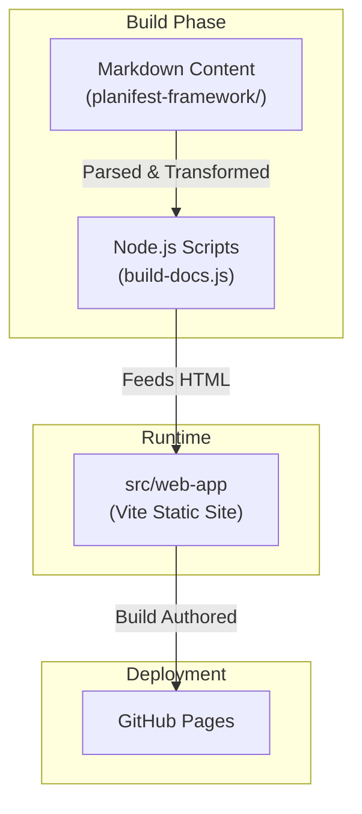

# Dependency Graph

```mermaid
graph TD
    subgraph Build Phase
        md["Markdown Content\n(planifest-framework/)"]
        builder["Node.js Scripts\n(build-docs.js)"]
    end
    
    subgraph Runtime
        webapp["src/web-app\n(Vite Static Site)"]
    end
    
    subgraph Deployment
        ghpages["GitHub Pages"]
    end

    md -- "Parsed & Transformed" --> builder
    builder -- "Feeds HTML" --> webapp
    webapp -- "Build Authored" --> ghpages
```
