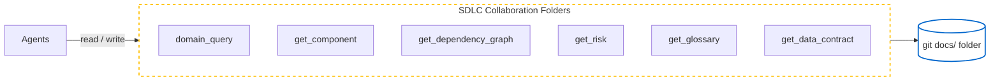
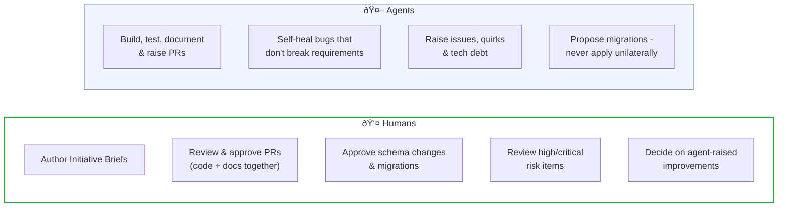

# Planifest - Master Plan


---

> Planifest is a **specification framework for agentic development**. It defines how requirements are captured, how decisions are recorded, and how agents are instructed and verified - across the full span of product, architecture, and engineering. This document is the canonical architecture reference. All sub-documents are linked via standard markdown links and diagrams are rendered as Mermaid.

> **Planifest gives agents the domain knowledge to build with purpose - and gives teams the visibility to trust what was built.**

---

## Table of Contents

- [1. What Planifest Is](#1-what-planifest-is)
- [2. System Overview](#2-system-overview)
- [3. SDLC Documentation Architecture](#3-sdlc-documentation-architecture)
- [4. Human and Agent Responsibilities](#4-human-and-agent-responsibilities)
- [5. Pipeline Architecture - New Initiatives](#5-pipeline-architecture-new-initiatives)
- [6. Pipeline Architecture - Change & Maintenance](#6-pipeline-architecture-change-maintenance)
- [7. Agent Orchestration Layer](#7-agent-orchestration-layer)
- [8. Artifact Types](#8-artifact-types)
- [9. Adoption Modes](#9-adoption-modes)
- [10. Monorepo Structure](#10-monorepo-structure)
- [11. Documentation Sync](#11-documentation-sync)
- [Local Dev - Agentic Tool Execution Mode](p010-planifest-agentic-tool-runbook.md)
- [MCP Design - Tool Server Architecture](roadmap/p005-planifest-mcp-architecture.md) *(roadmap)*
- [Functional Decisions](p003-planifest-functional-decisions.md)
- [The Pathway to Agentic Development](p004-the-pathway-to-agentic-development.md)

---

## 1. What Planifest Is

Planifest is a specification framework for agentic development. It is not a code generator. It is not a CI/CD tool. It is the layer that gives agents the domain knowledge to build correctly - and gives teams the evidence to verify they did.

A **Planifest** is the plan and the manifest: the plan is what will be built, the manifest is what it builds against. For every initiative, the orchestrator agent produces a Planifest - a single document that records both. You cannot plan what to build without recording what you're building against.

**The root problem** Planifest solves is not the absence of good tooling - it is the absence of domain knowledge. Agents cannot acquire domain knowledge implicitly the way an experienced developer does. Without it, they generate code that is technically correct but architecturally wrong. They make decisions that have already been made. They create components that overlap with ones that already exist. They build quickly, and incorrectly, at scale.

Planifest builds a structured domain for agents to reason within: what the system does, what it is made of, what decisions have been made and why, how each component relates to the whole. When an agent is asked to build something, it works within that domain - not in isolation.

Planifest specifies three layers of every initiative:

- **Product** - Functional requirements. What the system must do. Derived from user stories, acceptance criteria, problem statements. The *Why* and the *What*.
- **Architecture** - Non-functional requirements. How the system must perform, scale, and operate. SLOs, latency budgets, availability targets, security constraints, cost boundaries. The *How it must behave*.
- **Engineering** - Technical delivery plan. Component design, data contracts, interface contracts, infrastructure, deployment topology. The *How it will be built*.

Across all three layers, Scope, Risks, and Dependencies are first-class concerns. Nothing significant is left implicit. See [Functional Decisions](p003-planifest-functional-decisions.md) for the full set of functional decisions.

---

## 2. System Overview

```mermaid
flowchart TD
    A([👤 Initiative Brief]) --> ORCH[Orchestrator]
    Z([👤 Adjustment / Bug Report]) --> ORCH

    ORCH --> SA[spec-agent]
    SA -->|spec complete?| GATE1{Hard gate}
    GATE1 -->|No - surface gaps| SA
    GATE1 -->|Yes| AA[adr-agent]
    AA --> CA[codegen-agent]
    CA --> VA[validate-loop]
    VA --> SEC[security-agent]
    SEC --> PRA[pr-agent]
    PRA --> HGATE([👤 PR Review])
    HGATE --> DA[docs-agent]
    DA --> DKS[(plan/, manifest/, docs/)]

    style A fill:transparent,stroke:#28a745,stroke-width:2px
    style Z fill:transparent,stroke:#28a745,stroke-width:2px
    style HGATE fill:transparent,stroke:#28a745,stroke-width:2px
    style GATE1 fill:transparent,stroke:#f0a500,stroke-width:2px
    style DKS fill:transparent,stroke:#0066cc,stroke-width:2px,stroke-dasharray: 5 5
```



> Planifest runs in two modes: any **CI/CD platform** (GitHub Actions, GitLab CI, Bitbucket Pipelines, CircleCI, etc.) using an LLM API, and any **agentic coding tool** (Claude Code, Cursor, Codex, Antigravity, GitHub Copilot, etc.) locally on a dev machine. See [Agentic Tool Runbook](p010-planifest-agentic-tool-runbook.md).

---

## 3. SDLC Documentation Architecture

The overarching SDLC folder structure (consisting of the `plan/`, `manifest/`, and `docs/` folders) is the most critical concept in Planifest. It acts as a structured, versioned file tree that captures everything Planifest knows about a system - per initiative, per component, and system-wide. Agents query these files before building anything. It is the mechanism by which the domain is made available to agents that cannot acquire it implicitly.



### Access path - v1.0

**Git `docs/` folder** - agents read and write documents directly via Agent Skills. Documents are colocated with code. No additional infrastructure required. Works locally and in CI.

A dedicated queryable Domain Knowledge Store MCP service is a roadmap item - see [RC-001](p014-planifest-roadmap.md).

### Agents query before generating

Before building any component, an agent must at minimum:
1. `get_component` - understand what already exists in the vicinity
2. `domain_query` - confirm no existing component has overlapping responsibility
3. `get_risk` - understand what risk has already been identified
4. `get_glossary` - confirm it is using the correct ubiquitous language

### Document versioning

Every document is versioned. Updates create new versions rather than overwriting. History is never destroyed - only superseded. Documents carry `author: "human" | "agent"` - agent-authored documents are always flagged distinctly.

See [MCP Design](roadmap/p005-planifest-mcp-architecture.md), [MCP Domain Service Spec](roadmap/p007-planifest-domain-knowledge-service-reference.md), and [MCP Interface Spec](roadmap/p006-planifest-domain-knowledge-service-interface.md) for the full MCP tool interface and conformance requirements *(roadmap - RC-001)*.

---

## 4. Human and Agent Responsibilities

Planifest is not zero human-in-the-loop. It is zero human-in-the-loop *for building*. Humans retain approval authority over anything that changes intent or carries irreversible consequences.



### Default rules

Conservative by default. Autonomy is earned progressively. Hard limits cannot be overridden under any circumstance. Rules can be relaxed per initiative as confidence grows - except hard limits, which are non-negotiable.

See [FD-007 - Default rules](p003-planifest-functional-decisions.md#fd-007--default-rules-are-conservative-autonomy-is-earned-progressively) for the full default rules table.

---

## 5. Pipeline Architecture - New Initiatives

Triggered when a new Initiative Brief is committed to the document store or vault.

**Specification is a hard gate.** The spec-agent and adr-agent surface every gap, ambiguity, or unresolved decision before passing work to the codegen-agent. The pipeline does not proceed until the specification is complete.



### Agent responsibilities

| Agent | Domain Knowledge Access (v1.0) | Output |
|---|---|---|
| spec-agent | Reads `docs/` and `plan/` folders directly | design-spec.md, openapi.yaml, scope.md, risk-register.md |
| adr-agent | Reads `docs/adr/` directly | docs/adr/*.md |
| codegen-agent | Reads component files; writes via filesystem | Full implementation + tests + IaC |
| security-agent | Reads source files directly | security-report.md |
| pr-agent | Via git push + CLI | PR with full description |
| docs-agent | Writes to `docs/` and `plan/` folders directly | SDLC folders updated |

---

## 6. Pipeline Architecture - Change & Maintenance



---

## 7. Agent Orchestration Layer

In v1.0, the pipeline is executed by a human-triggered agent session following the orchestrator skill. The orchestrator skill sequences the phase skills, and each agent reads and writes files directly.

A fully automated orchestrator service (watching for Initiative Briefs, running the pipeline as a CI state machine) is a roadmap item - see [RC-002](p014-planifest-roadmap.md). A serial write queue to structurally eliminate concurrent merge conflicts is [RC-003](p014-planifest-roadmap.md).

Code and docs are always committed together in a single atomic operation. Neither is ever committed without the other - enforced by the pipeline skill instructions and reviewed at the PR gate.

### Agent interface

```typescript
type AgentContext = {
  runId: string
  goal: string
  initiativeId: string
  componentId?: string
}

type AgentResult = {
  status: "complete" | "blocked" | "failed"
  blockedReason?: string    // surfaces a spec gap if blocked
  outputPaths: string[]     // files written to disk
}
```

---

## 8. Artifact Types

Planifest defines distinct artifact types. No artifact bleeds into another. Each is maintained and versioned independently.

**Per Initiative:**

| Artifact | Purpose |
|---|---|
| Initiative Brief | What needs to be built and why |
| Design Specification | Functional and non-functional requirements |
| OpenAPI Specification | Language-agnostic API contract - generated first |
| ADRs | Every significant decision with context and consequences |
| Risk Register | Technical, operational, security, compliance risks |
| Scope | In / out / deferred |
| Security Report | Threat model, dependency audit, auth/authz, network policy |
| Quirks | Known oddities, workarounds, acknowledged tech debt |
| Recommendations | Suggested improvements for future iterations |
| Operational Model | Runbook triggers, on-call expectations, alerting thresholds |
| SLO Definitions | Error budgets, SLIs/SLOs |
| Cost Model | Compute, storage, egress, third-party cost estimates |
| Domain Glossary | Ubiquitous language - agents must respect it |

**Per Component:**

| Artifact | Purpose |
|---|---|
| Component Purpose | What this component exists to do in the wider system |
| Interface Contract | Inputs, outputs, schema, consumers, breaking change policy |
| Dependencies | What it consumes / what depends on it |
| Data Contract | Schema, invariants, ownership - one owner per dataset |
| Migration History | Full history of schema changes - never destroyed |
| ADRs | Component-level decisions |
| Risk | Component-scoped risk items |
| Scope | Component-scoped in / out / deferred |
| Quirks | Component-scoped oddities |
| Test Coverage Summary | Coverage state at point of generation |
| Known Tech Debt | Explicitly acknowledged debt |

**System-wide:**

| Artifact | Purpose |
|---|---|
| Component Registry | Index of every component - what it is, what it does |
| Dependency Graph | How components relate to each other |

---

## 9. Adoption Modes

| Mode | `initiative_mode` | Entry point | Description |
|---|---|---|---|
| **Greenfield** | `greenfield` | Initiative Brief | New system, no prior codebase. Pipeline runs spec to PR. |
| **Retrofit** | `retrofit` | Existing codebase | spec-agent performs codebase ingestion first - scans, infers architecture, generates ADRs from what exists. Surfaces drift and tech debt before any new code. |
| **Agent Interface Layer** | `agent-interface` | Interface spec | Large or complex component library. Interface layer specified first; agents develop against it, not the internals. |

---

## 10. Monorepo Structure

```
monorepo/
├── planifest-framework/
│   ├── skills/
│   │   ├── planifest-orchestrator/SKILL.md   # Entry point - coaching + sequencing
│   │   ├── planifest-spec-agent/SKILL.md     # Produce specification artifacts
│   │   ├── planifest-adr-agent/SKILL.md      # Produce ADRs
│   │   ├── planifest-codegen-agent/SKILL.md  # Implement against spec
│   │   ├── planifest-validate-agent/SKILL.md # Run checks, self-correct
│   │   ├── planifest-security-agent/SKILL.md # Security assessment
│   │   ├── planifest-docs-agent/SKILL.md     # Complete documentation
│   │   └── planifest-change-agent/SKILL.md   # Change pipeline
│   ├── adapters/
│   │   ├── claude-code/CLAUDE.md
│   │   ├── cursor/.cursorrules
│   │   ├── copilot/copilot-instructions.md
│   │   └── antigravity/planifest.yaml
│   └── templates/                  # Artifact templates
│       ├── initiative-brief.md
│       ├── component-manifest.template.json
│       ├── pipeline-run.template.md
│       └── ...
├── plan/                           # Active and historical plans
│   ├── planifest.md            # The Planifest for the active change
│   ├── initiative-brief.md     # The brief for the active change
│   ├── design-spec.md          # Active initiative-level artifacts
│   ├── openapi-spec.yaml
│   ├── domain-glossary.md
│   ├── risk-register.md
│   ├── scope.md
│   ├── operational-model.md
│   ├── slo-definitions.md
│   ├── cost-model.md
│   ├── security-report.md
│   ├── adr/
│   │   └── ADR-001-*.md
│   ├── changelog/                  # Log of all pipeline/change runs
│   │   └── {initiative-id}-<YYYY-MM-DD>.md
│   └── {initiative-id}/            # Historical plans, moved here post-review
│       └── <historical active plan contents>
├── src/
│   └── {component-id}/
│       ├── component.json          # Component manifest
│       ├── apps/ | packages/ | infra/   # Implementation
│       └── docs/                   # Component-level artifacts
│           ├── purpose.md
│           ├── interface-contract.md
│           ├── data-contract.md
│           ├── dependencies.md
│           ├── risk.md
│           ├── scope.md
│           ├── quirks.md
│           ├── tech-debt.md
│           └── migrations/
├── docs/                           # Repo-wide state
│   ├── component-registry.md
│   └── dependency-graph.md
└── README.md
```

---

## 11. Documentation Sync

Every agent output is a markdown document, written to `plan/current/` (initiative-level artifacts) or `src/{component-id}/docs/` (component-level artifacts), with repo-wide state in `docs/`. The git repository is the documentation system - markdown and Mermaid render natively on GitHub, GitLab, and Bitbucket. No additional sync infrastructure is required for v1.0.

Teams that want a richer documentation experience (Obsidian, Notion, Confluence) can integrate at the documentation provider level - see [RC-005 - Pluggable Documentation Provider](p014-planifest-roadmap.md) in the roadmap.

---

---

*This document is the living Planifest architecture reference. As the system evolves, agents update it.*

*Related: [Functional Decisions](p003-planifest-functional-decisions.md) | [The Pathway to Agentic Development](p004-the-pathway-to-agentic-development.md) | [Agentic Tool Runbook](p010-planifest-agentic-tool-runbook.md) | [Pilot App](p011-planifest-pilot-app.md) | [Backend Stack Evaluation](p013-planifest-backend-stack-evaluation.md) | [Roadmap](p014-planifest-roadmap.md) | [Frontend Stack Evaluation](p016-planifest-frontend-stack-evaluation.md) | [Strategic Intent vs Stochastic Execution](p017-research-report-strategic-intent-vs-stochastic-execution.md) | [Code Quality Standards](../planifest-framework/standards/code-quality-standards.md)*
