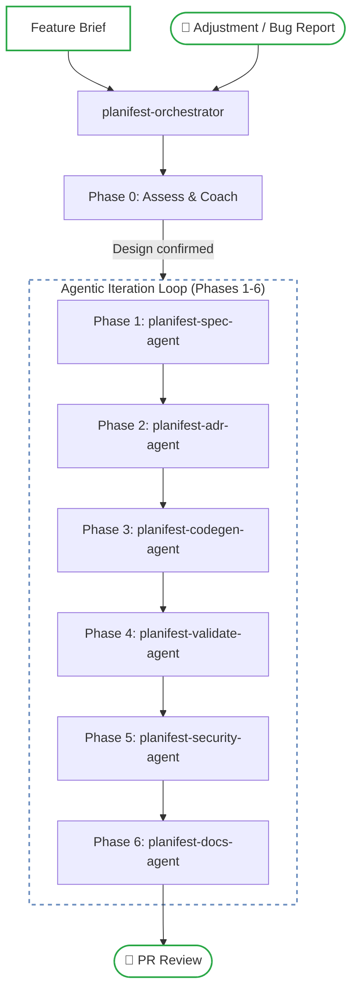
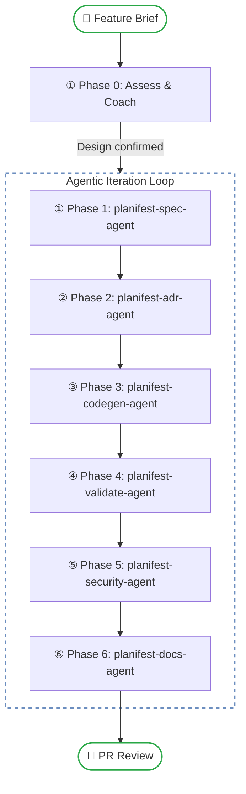
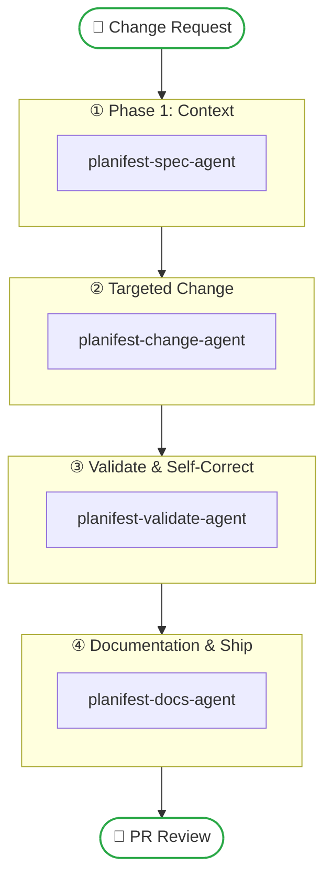

# Planifest - Master Plan

---

> Planifest is a **requirements framework for agentic development**. It defines how requirements are captured, how decisions are recorded, and how agents are instructed and verified - across the full span of product, architecture, and engineering. This document is the canonical architecture reference. All sub-documents are linked via standard markdown links and diagrams are rendered as Mermaid.

> **Planifest gives agents the domain knowledge to build with purpose - and gives teams the visibility to trust what was built.**

---

## 1. What Planifest Is

Planifest is a requirements framework for agentic development. It is not a code generator. It is not a CI/CD tool. It is the layer that gives agents the domain knowledge to build correctly - and gives teams the evidence to verify they did.

A **confirmed design** is the plan and the manifest: the plan is what will be built, the manifest is what it builds against. For every feature, the orchestrator agent produces a **confirmed design** - a single document that records both. You cannot plan what to build without recording what you're building against.

**The root problem** Planifest solves is not the absence of good tooling - it is the absence of domain knowledge. Agents cannot acquire domain knowledge implicitly the way an experienced developer does. Without it, they generate code that is technically correct but architecturally wrong. They make decisions that have already been made. They create components that overlap with ones that already exist. They build quickly, and incorrectly, at scale.

Planifest builds a structured domain for agents to reason within: what the system does, what it is made of, what decisions have been made and why, how each component relates to the whole. When an agent is asked to build something, it works within that domain - not in isolation.

Planifest specifies three layers of every feature:

- **Product Layer**: Functional Requirements (What the system does and why).
- **Architecture Layer**: Standards (Cross-cutting rules and non-functional requirements).
- **Engineering Layer**: Implementation (How the system was actually built).

Across all three layers, Scope, Risks, and Dependencies are first-class concerns. Nothing significant is left implicit. See [Functional Decisions](p003-planifest-functional-decisions.md) for the full set of functional decisions.

---

## 2. System Overview

Planifest is composed of three core concepts: the **Documentation Architecture**, the **Three-Track Pipeline**, and the **Agent Skills**.



---

## 3. SDLC Documentation Architecture

Planifest builds a domain by writing to a structured set of folders versioned in Git. Every artifact is a markdown or YAML file.

### Layer 1: The Plan (`plan/`)
Captures the *intent* and the *decisions* for a specific feature.
- `current/` - The design, brief, requirements, and ADRs for the change in progress.
- `archive/` - Historical features filed after merge.
- `changelog/` - A human-readable record of all system changes.

### Layer 2: The Manifest (`src/{component}/component.yml`)
The single source of truth for component domain knowledge. Captures the *contract* and *state* of the implementation. It replaces separate markdown files for purpose, scope, and risk.

### Layer 3: The Library (`docs/`)
Repository-wide knowledge and artifact history.
- `adr/` - All component-specific and system-level ADRs.
- `migrations/` - Data migration history per component.
- `component-registry.md` - Index of all system components.
- `dependency-graph.md` - Visualisation of component relationships.

---

## 4. Human and Agent Responsibilities

Planifest is not for zero human-in-the-loop. It is for zero human-in-the-loop for *building*. Humans remain the source of truth and approval authority.

| Role | Responsibility |
|---|---|
| **Human** | Author the Feature Brief, coach Phase 0, approve PRs, approve schema changes, review high-risk items. |
| **Agent** | Triage the track, requirements, build, test, document, self-heal logic bugs, propose migrations. |

### Three-Track Decision Tree (Scope-based Routing)

Every incoming request is triaged into one of three execution tracks based on the scope of the change:

| Track | Signal | Rigour |
|---|---|---|
| **Fast Path** | UI styling, copy/text changes, or isolated pure-function logic bugs. No schema changes. | **Low**: Bypass requirements/ADR. Direct implementation + validation. |
| **Change Pipeline** | Targeted bug fix or modification to 1-2 existing components. | **Medium**: Phase 1 Context -> Phase 2 Change -> Phase 3 Validate. |
| **Feature Pipeline** | New features, ≥ 3 user stories, or touches > 3 components. | **High**: Full Phase 0-6 Agentic Iteration Loop. |

See [Planifest Pipeline](p015-planifest-pipeline.md) for detailed criteria per track.

---

## 5. Pipeline Architecture - Feature Pipeline

Triggered when a new Feature Brief is provided.



1. **Phase 0: Assess and Coach** ([planifest-orchestrator]) - Validates the brief, coaches gaps, reaches **Design confirmed** status.
2. **Phase 1: Requirements** ([planifest-spec-agent]) - Produces the Execution Plan and OpenAPI spec.
3. **Phase 2: Architecture Decisions** ([planifest-adr-agent]) - Records ADRs for the feature.
4. **Phase 3: Code Generation** ([planifest-codegen-agent]) - Full implementation, tests, and IaC.
5. **Phase 4: Validate** ([planifest-validate-agent]) - CI validation and self-correction.
6. **Phase 5: Security** ([planifest-security-agent]) - Produces the security assessment report.
7. **Phase 6: Documentation & Ship** ([planifest-docs-agent]) - Updates manifest, registry, and changelog.

---

## 6. Pipeline Architecture - Change & Maintenance

Triggered for modifications to existing systems.



---

## 7. Agent Orchestration Layer

The pipeline is orchestrated as a state machine. Each agent skill is a distinct tool invocation with scoped context.

- **Idempotency**: Re-running a phase with the same input produces the same output.
- **Self-Correction**: Agents observe CI failures and iterate (max 5 cycles).
- **Auditability**: Every decision and generation is recorded in the `iteration-log.md`.

---

## 8. Artifact Types

See [Functional Decisions: FD-019](p003-planifest-functional-decisions.md#fd-019---documentation-is-granular-versioned-and-machine-readable) for the full list of artifacts.

- **Product Layer**: Functional Requirements.
- **Architecture Layer**: Standards.
- **Engineering Layer**: Implementation.

---

## 9. Adoption Modes

| Mode | Entry Point | Ingestion Requirement |
|---|---|---|
| **Greenfield** | Feature Brief | None. |
| **Retrofit** | Existing codebase | High - scan repo, infer architecture, generate initial ADRs. |
| **Agent Interface** | Interface Spec | Medium - scope to the interface contract. |

---

## 10. Monorepo Structure

```
monorepo/
├── planifest-framework/
│   ├── skills/
│   │   ├── planifest-orchestrator/SKILL.md   # Entry point
│   │   ├── planifest-spec-agent/SKILL.md
│   │   ├── ...
│   ├── setup/                        # Tool setup scripts
│   ├── templates/                      # Artifact templates
├── plan/                           # Execution plans
│   ├── current/
│   │   ├── design.md               # Confirmed design
│   │   ├── feature-brief.md
│   │   ├── iteration-log.md
│   │   └── ...
│   ├── archive/                     # Historical features
│   └── changelog/                   # Audit log
├── src/
│   └── {component-id}/
│       ├── component.yml           # Component manifest (Single Source of Truth)
│       └── apps/ | packages/ | infra/   # Implementation
└── docs/                           # Repo-wide state & artifact history
    ├── adr/                        # Component-specific ADRs (persisted)
    ├── migrations/                  # Component migration records
    ├── component-registry.md
    └── dependency-graph.md
README.md
```

---

## 11. Documentation Sync

The documentation destination is pluggable. Files in `plan/` and `docs/` are the primary source of truth. The `planifest-docs-agent` can sync these to external providers:
- Git (default)
- Obsidian
- Notion
- Confluence

---

*Part of the Planifest project. Related: [Pilot App](p011-planifest-pilot-app.md) | [Pipeline Reference](p015-planifest-pipeline.md)*
