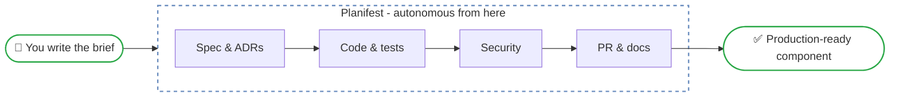
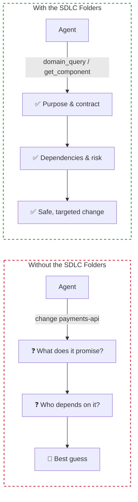

# Planifest - Product Concept

## Version Log

| Version | Change Description | Date | Changed By |
|---|---|---|---|
| 1 | Initial document | 02 MAR 2026 | Martin Mayer |
| 2 | Reframed as specification framework; corrected human gate language; added domain knowledge, adoption modes, data contracts | 05 MAR 2026 | Martin Mayer |
| 3 | Added Planifest name etymology; reframed solution as Agent Skills delivery; removed TypeScript-specific language and pluggable docs provider | 07 MAR 2026 | Martin Mayer (via agent) |
| 4 | Replaced MCP servers with Agent Skills in open source library description | 12 MAR 2026 | Martin Mayer (via agent) |

---

> A **specification framework for agentic development** that takes a human-written brief and delivers a fully implemented, tested, documented, and security-reviewed software component - autonomously.

---

## The Problem

Software development has two persistent bottlenecks that tooling has never fully solved.

The first is the gap between intent and implementation. A product owner writes a brief. An engineer interprets it, writes a spec, makes architecture decisions, scaffolds a project, implements it, writes tests, documents it, and opens a PR. Each translation introduces delay, drift, and inconsistency. The brief and the code are rarely in sync by the time anything ships.

The second is the maintenance burden of what's already been built. Every component in a codebase carries implicit knowledge - why it was built that way, who depends on it, what you can safely change. That knowledge lives in people's heads and degrades over time. When someone needs to change a component months later, they start from uncertainty.

Existing tools address parts of this. GitHub Copilot accelerates individual coding. CI/CD platforms automate testing and deployment. Documentation tools help with wikis. But nothing connects the full chain - from intent to running code - and nothing gives agents the structured domain knowledge they need to build with purpose and avoid the most common failure mode: code that is technically correct but architecturally wrong.

---

## The Solution

Planifest is a specification framework for agentic development, delivered as a set of Agent Skills that any compatible tool can load and follow.

A Planifest is the plan and the manifest: the plan is what will be built, the manifest is what it builds against.

A human writes an Initiative Brief. The orchestrator agent assesses it against what a complete Planifest specification requires, coaches the human through any gaps - one question at a time - and produces the validated Planifest. Once confirmed, a coordinated set of agent skills produces the complete artifact:

- Design specification derived from the brief
- Architecture Decision Records for every significant choice
- Full implementation - frontend, backend, shared types, tests
- Infrastructure as code
- Security assessment
- PR with structured description, ready for human review
- Documentation written alongside the code in the git repository

For changes to existing components, agents load structured context about the component before acting - its contract, its consumers, its change policy - and produce a targeted diff rather than a full regeneration.

---

## The USP

**Most agentic coding tools make agents smarter at writing code. Planifest makes agents smarter about the system they are writing code for.**

The differentiating layer is the structured SDLC documentation architecture (plan, manifest, and docs folders) covering every initiative, component, and system-level concern. It answers the questions a human engineer would ask before touching anything: what does this component exist to do, who depends on it, what data does it own, what decisions have been made about it, and what is the blast radius of a mistake.

Without this layer, agents are powerful but blind. They produce code that is technically plausible but architecturally wrong - making decisions already made, creating components that overlap with existing ones, breaking contracts they didn't know existed. Planifest gives agents the same situational awareness a senior engineer builds up over months on a codebase - encoded in a structured store, always current, always queryable.

The second differentiator is the coaching conversation. The orchestrator agent does not accept a vague brief and start building. It assesses the brief against what a complete specification requires, identifies gaps, and coaches the human through them - one question at a time, scientifically, without allowing corners to be cut. The specification is the standard against which everything downstream is assessed. Planifest insists on completeness first.

The third differentiator is documentation as a first-class output. Every pipeline run produces a rich set of versioned artifacts - design specs, ADRs, security reports, data contracts, migration history, domain glossary, SLO definitions, cost models - written alongside the code they describe. The artifacts are the source of truth, stored as markdown in the git repository.

---

## What This Could Become

**As an open source library**, Planifest could be a composable specification framework and set of Agent Skills that any team drops into their monorepo. The document schema is the API surface - teams adopt it, and the rest of the tooling builds on top. The SDLC folder structure, the pipeline templates, the agent prompts, and the documentation sync are all independently useful and independently adoptable. Teams bring their own CI platform, their own cloud, and their own documentation system - Planifest adapts to each. Three adoption modes cover the full spectrum: greenfield, retrofit of an existing system, and the Agent Interface Layer for complex domains.

**As a product**, the opportunity is the intelligence layer itself. The Component Registry becomes a SaaS service - teams connect their repos, manifests are indexed, and agents across any tool (Claude Code, Copilot, Cursor, CI pipelines) can query the registry to understand the codebase before acting. The value compounds as more components are registered and more change history is accumulated. The observability store - tracking which components fail most, which briefs are consistently underspecified, how many retries a given agent needs - becomes a product analytics layer for engineering quality.

**The wedge** is the open source library. Teams adopt it because the pipeline templates and Agent Skills are immediately useful and free. The registry SaaS becomes valuable as the number of components grows and the need for cross-tool, cross-session component intelligence becomes real.

---

## What It Is Not

Planifest is not a general-purpose coding assistant. It does not replace engineers. It is not trying to generate any kind of software from a vague description.

It is a specification framework for teams that already know how to build software and want agents to build correctly within a defined domain. The quality of the output is bounded by the quality of the specification. Human judgement moves to the highest-value moments - brief authoring, PR review, and approving anything irreversible - rather than being eliminated.

---

*Related: [Master Plan](p001-planifest-master-plan.md) | [Roadmap](p014-planifest-roadmap.md)*
