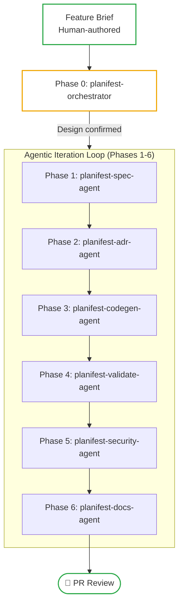

# The Pathway to Agentic Development for Real-World Systems

---

> A living document capturing the concepts, patterns, and adoption strategies for Planifest - a requirements framework for agentic development. To be augmented with use cases and patterns.

*Related: [Master Plan](p001-planifest-master-plan.md) | [Functional Decisions](p003-planifest-functional-decisions.md) | [Strategic Intent vs Stochastic Execution](p017-research-report-strategic-intent-vs-stochastic-execution.md)*

---

## 1. The Strategy

Software development has two persistent bottlenecks: the gap between intent and implementation, and the maintenance burden of implicit knowledge.

### The Problem With Agentic Development in Practice

Teams adopting generative AI often discover that while agents produce code quickly, the human overhead of reviewing, correcting, and explaining context compounds as the system grows. Agents see what’s in their context window but can’t infer the architectural reasoning behind it. They make local decisions that are technically correct but architecturally wrong.

### The Safety and Visibility Problem

Efficiency is only half the battle. Control is the other. Without an audit trail of decisions, teams are stuck between **uncontrolled autonomy** (opaque and risky) and **supervised micro-management** (slow and expensive).

### The Root Cause: Missing Domain Knowledge

Agents cannot acquire domain knowledge implicitly like experienced developers. They need a structured domain to reason within. Planifest solves this by building that domain-a requirements set of the system that covers:
- **Product Layer**: The **Why** and the **What** (Functional requirements, user stories, AC).
- **Architecture Layer**: The **How it Performs** (Operating parameters: SLOs, security, cost).
- **Engineering Layer**: The **How it is Built** (Technical delivery: component design, data contracts, topology).

> Planifest gives agents the domain knowledge to build with purpose - and gives teams the visibility to trust what was built.

---

## 2. Core Principles

### Requirements-First Development

Planifest insists on **requirements before development**. Agents do not begin coding until the status is **Design confirmed**. The requirements are not just an input; it is the standard against which all outputs are assessed.

### Phase 0 - Assess and Coach (Hard Gate)

The orchestrator agent (**planifest-orchestrator**) begins by assessing the **Feature Brief**. It identifies gaps, ambiguities, or missing considerations. It coaches the human through these gaps - one question at a time - until the **confirmed design** (`plan/current/design.md`) is produced.

**The human must grant Design confirmed status before the pipeline proceeds.**

---

## 3. The Pipeline: End-to-End Flow

### Three-Track Decision Tree (Scope-based Routing)

1. **Fast Path**: Narrow, low-risk changes (styles, copy, pure-function bugs). Low rigour.
2. **Change Pipeline**: Targeted modifications to existing components via **planifest-change-agent**. Medium rigour.
3. **Feature Pipeline**: Full Phase 0-6 sequence for new features or significant changes. High rigour.

---

## 4. Adoption Patterns

| Mode | Entry Point | Path |
|---|---|---|
| **Greenfield** | Feature Brief | Requirements -> Build |
| **Retrofit** | Existing codebase | Ingest -> Requirements -> Build |
| **Agent Interface** | Interface Spec | Abstract -> Requirements -> Build |

### Greenfield
The simplest entry point. The orchestrator coaches from scratch to produce the design, and the pipeline runs from requirements to PR.

### Retrofit (Existing Codebases)
The most common case. Before a change, the `planifest-spec-agent` performs **codebase ingestion**: scanning the repo, inferring architecture, and generating ADRs from what exists. It then reconciles the brief against reality before building.

### Agent Interface Layer
For high complexity. Specify a well-defined interface layer first in the **component.yml**. The agent develops against the interface, not the internals, keeping context tightly scoped and outputs predictable.

---

## 5. Artifacts and SDLC Folders

Planifest builds a structured, versioned file tree in `plan/`, `src/`, and `docs/`.

### Per Feature (in `plan/current/`)
- Feature Brief, Confirmed Design (`design.md`)
- Design Requirements, OpenAPI Specification
- ADRs, Risk Register, Scope, Security Report
- Operational Model, SLO Definitions, Cost Model, Domain Glossary

### Per Component (`src/{component}/component.yml`)
The **component.yml** is the single source of truth for component domain knowledge. It replaces individual markdown files for:
- **Purpose & Context**: Summary, system context, and responsibilities.
- **Interface Contract**: API specs, inputs, outputs, and consumedBy/consumes dependencies.
- **Data Contract**: Ownership, schema version, and migration paths.
- **Scope & Risk**: Explicit in/out/deferred scope and risk items/level.
- **Quality & Health**: Test coverage, tech debt, and quirks.

### Supporting Artifacts (in global `docs/`)
- **Component-specific ADRs** (`docs/adr/`)
- **Migration History** (`docs/migrations/`)
- **Component Registry** (`docs/component-registry.md`)
- **Dependency Graph** (`docs/dependency-graph.md`)

---

## 6. Terminology

| Term | Definition |
|---|---|
| **Feature Brief** | The human-authored seed document that initiates the pipeline. |
| **Confirmed Design** | The output of Phase 0 (`plan/current/design.md`). |
| **Design confirmed** | The hard gate status required to proceed past Phase 0. |
| **Agentic Iteration Loop** | The collective sequence of Phases 1-6. |
| **ADR** | Architecture Decision Record. Lives in `plan/current/adr/`. |
| **Data Contract** | Singular ownership of data schema and invariants. |

---

*Part of the confirmed design project.*
