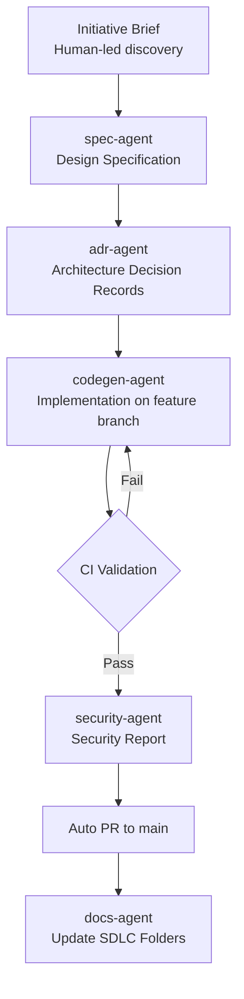
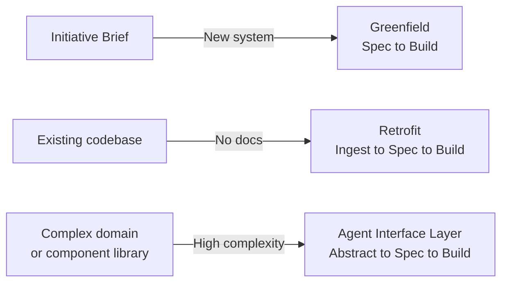

# The Pathway to Agentic Development for Real-World Systems

---

> A living document capturing the concepts, patterns, and adoption strategies for Planifest - a specification framework for agentic development. To be augmented with use cases and patterns.

---

## The Problem With Agentic Development in Practice

Teams adopting generative AI for development often discover the same uncomfortable truth: the net saving can be negligible. At times, the overall effort increases.

This isn't because the tools don't work. It's because of where the effort goes. A developer using an AI coding assistant doesn't just prompt and ship. They prompt, review, correct, re-prompt, verify against existing patterns, check for regressions, reconcile with what the rest of the codebase already does, and then spend time explaining to the agent what they already know implicitly. The agent produces output quickly. The human spends their time validating it.

For greenfield projects, this is manageable early on - but it compounds as the system grows. More components mean more context the agent doesn't have. More decisions already made that the agent doesn't know about. More opportunities for the generated code to be technically correct but architecturally wrong. The overhead of managing the agent grows with the codebase.

For teams working on existing production systems, the challenge is more acute. The codebase wasn't built with agents in mind. There's no spec. There's no structured description of what the system does or why it was built the way it was. There are conventions the agent can't infer and constraints it can't see. Teams end up spending as much time correcting the agent as they would have spent writing the code themselves - and sometimes more, because now they're also debugging generated code they didn't write.

### The Safety and Visibility Problem

Efficiency is only half the problem. The other half is control - and for many teams, it surfaces first.

When an autonomous agent builds something, how do you know it built the right thing? How do you know it followed your architectural decisions, respected your security constraints, stayed within the scope you defined? How do you verify it without reading every line of code it produced?

Most teams can't answer these questions confidently. The agent's reasoning is opaque. There's no audit trail of the decisions it made. There's no way to compare what was intended against what was built without reverting to the kind of detailed human review that eliminates the productivity benefit in the first place.

This puts teams between two bad options:

- **Uncontrolled autonomy** - let the agent run and trust the output. Fast, but opaque. Architectural drift, invisible tech debt, and decisions made without context accumulate silently.
- **Supervised micro-management** - a human reviews every output in detail. Safe, but slow. The agent becomes an expensive autocomplete.

Neither is a viable path to genuinely autonomous development at scale.

### The Root Cause: Missing Domain Knowledge

The common thread across both failure modes isn't just the absence of a spec. It's the absence of domain knowledge - and agents, unlike experienced developers, cannot acquire it implicitly.

A senior engineer joining a team absorbs domain knowledge over time. They learn what the system is trying to do, how the components relate to each other, what constraints exist and why, which decisions are settled and which are open. They build a mental model of the whole - and that model is what lets them make good local decisions. When they touch a component, they understand its purpose in the wider system.

Agents don't have that. They see what's in their context window. They can read code, but they can't infer the reasoning behind it. They can generate a component that works in isolation and is entirely wrong for the system it's being built into. And without domain knowledge to orient them, they'll do exactly that - repeatedly, at speed.

This is what Planifest is built to solve. It doesn't just produce a spec - it builds a domain for agents to understand. A structured representation of the system: what it does, what it's made of, what decisions have been made and why, and how each component relates to the whole. When an agent is asked to build something, it isn't working in isolation. It's working within a domain it can reason about - one where its output can be oriented to the wider system, not just the immediate task.

Critically, Planifest specifies the *How* as well as the *Why* and the *What* - covering Product, Architecture, and Engineering as distinct layers of every initiative, with Scope, Risks, and Dependencies recorded throughout. And it produces reporting outputs - documentation, ADRs, security reports, PR descriptions - that let teams verify those instructions were followed. Not by reading every line of code, but by reviewing the evidence the pipeline produces alongside the outcomes it delivers.

> Planifest gives agents the domain knowledge to build with purpose - and gives teams the visibility to trust what was built.

---

## What is Planifest?

Planifest is a specification framework for agentic development. It defines how requirements are captured, how decisions are recorded, and how agents are instructed and verified - across the full span of product, architecture, and engineering.

A Planifest is the plan and the manifest: the plan is what will be built, the manifest is what it builds against. For every initiative, the orchestrator agent produces a Planifest - a single document that records both.

### Scope

Planifest endeavours to describe three layers of every initiative:

- **Product** - Functional Requirements. What the system must do. Derived from user stories, acceptance criteria, and problem statements. The *Why* and the *What*.
- **Architecture** - Non-functional Requirements. How the system must perform, scale, and operate. SLOs, latency budgets, availability targets, security constraints, cost boundaries. The *How it must behave*.
- **Engineering** - Technical Delivery Plan. How the system will be built. Component design, data contracts, interface contracts, infrastructure, deployment topology. The *How it will be built*.

Across all three layers, Planifest captures Scope, Risks, and Dependencies as first-class concerns - along with all decisions made around them. Nothing significant is left implicit.

### Specification Before Development

A core principle of the Planifest framework: **agents do not begin development until the specification is complete**.

The orchestrator agent assesses the Initiative Brief against what a complete Planifest specification requires, coaches the human through any gaps - one question at a time, in priority order - and produces the validated Planifest. The human confirms it. Only then does the spec-agent produce artifacts and the pipeline proceed. If the specification contains gaps, ambiguities, or unresolved decisions, the orchestrator surfaces them and waits for resolution. An incomplete specification produces incomplete, inconsistent, or incorrect software. The framework does not permit the pipeline to proceed until the foundation is sound.

This is what separates Planifest from a code generation tool. Code generation can begin with a partial brief and produce something plausible. Planifest insists on completeness first - because the specification is not just the input to the pipeline, it is the standard against which all outputs are assessed.

The Initiative Brief is the initiating input - the point at which a human starts the pipeline. Everything from that point is executed by a set of agent skills, each operating against the verified outputs of the skills before it. Humans retain approval authority at defined gates: the Planifest confirmation, the PR review, schema changes and migrations, high/critical risk items, and decisions about agent-raised improvements.

---

## The Pipeline: End-to-End Flow

### Phase 1 - Human-Led Discovery *(the initiating step)*

A product owner or tech lead writes an **Initiative Brief** - a structured markdown document covering: problem statement, user stories, acceptance criteria, constraints, and known integrations. This is the seed that initiates the pipeline. Everything downstream is autonomous in execution, but humans retain approval authority at defined gates: the PR review, schema changes and migrations, high/critical risk items, and agent-raised improvements.

### Phase 2 - Agentic Specification Generation

A `spec-agent` ingests the Initiative Brief and produces the full initiative artifact set:

- Design Specification (functional and non-functional requirements)
- OpenAPI Specification (generated first - everything downstream implements against it)
- Scope (in / out / deferred)
- Risk Register (technical, operational, security, compliance)
- Domain Glossary (ubiquitous language - agents must use and respect it)
- Cost Model (compute, storage, egress, third-party estimates)
- Operational Model (runbook triggers, on-call expectations, alerting thresholds)
- SRE considerations (error budgets, SLIs/SLOs, observability requirements)

The spec is committed to the repo alongside the code.

### Phase 3 - Architecture Decision Records

An `adr-agent` generates ADRs for every significant decision: framework choice, database selection, auth strategy, deployment topology, queue vs sync, etc. Each ADR follows the standard format - Context, Decision, Status, Consequences. These live in `docs/adr/`.

### Phase 4 - Agentic Code Generation

A `codegen-agent` takes the Design Spec + ADRs and generates the implementation on a feature branch:

- Scaffolds the project structure (monorepo with `apps/web`, `apps/api`, `packages/shared`)
- Generates TypeScript source for both React frontend and Node backend
- Writes unit tests, integration tests, and contract tests
- Produces Dockerfiles, docker-compose for local dev, and IaC (Terraform/Pulumi)
- Generates OpenAPI spec from the functional requirements, then implements against it

### Phase 5 - Automated Validation

CI runs on the feature branch - linting, type-checking, tests, container builds, security scanning (SAST/SCA). If anything fails, the `codegen-agent` gets the failure output and self-corrects in a loop (with a max retry cap to avoid infinite cycles).

### Phase 6 - Security Report

A `security-agent` produces a security assessment: threat model (STRIDE), dependency audit, secrets management review, auth/authz analysis, network policy review. Written to `docs/security-report.md`.

### Phase 7 - PR to Main

Once CI is green, the pipeline auto-creates a PR from the feature branch to main. The PR description includes: summary of changes, links to Design Spec, ADRs, and security report, a "quirks" section (known oddities, workarounds, tech debt), and recommendations for improvement.

### Phase 8 - Documentation Sync

All artifacts - Design Spec, ADRs, Security Report, Quirks, Recommendations, Domain Glossary, Data Contracts, SLO Definitions, Cost Model - are written to the `plan/` and `docs/` folders as part of the SDLC and synced to the configured documentation provider. The documentation destination is pluggable: git `docs/` is the default, with Obsidian, Notion, and Confluence as supported alternatives.

---

## Stack Configuration

Planifest does not default a stack. Per FD-015, stack is a requirement - declared explicitly at system or initiative level, traceable to an ADR, never assumed by the pipeline. Agents implement against whatever is declared; any deviation requires a justification.

Not all stacks are equal for agent-generated code. The [Backend Stack Evaluation](p013-planifest-backend-stack-evaluation.md) scores 13 backend frameworks against agent-specific criteria - compile-time error detection, error feedback clarity, first-pass success rate, self-correction iteration cost - and finds significant differences. Go achieves the highest first-pass success rate. Rust offers the strongest compile-time guarantees but at higher iteration cost. Node.js/TypeScript has the broadest SDK coverage and highest LLM fluency. A polyglot architecture - different stacks for different components - is a legitimate choice when each selection is justified by the component's requirements and recorded in an ADR.

The same applies to frontend choices. The [Frontend Stack Evaluation](p016-planifest-frontend-stack-evaluation.md) scores 10 frontend frameworks and finds that React 19 + Vite + TypeScript, paired with a constrained design system (Tailwind CSS + shadcn/ui), achieves the highest agent success rates - 70-80% functional, 55-65% visual on first pass. Frontend correctness has two dimensions: functional and visual. The evaluation recommends specifying the component library and state management pattern explicitly to constrain agent output quality.

The Planifest pilot uses a specific confirmed stack - React, Fastify, PostgreSQL, Pulumi, GCP Cloud Run. That is a decision for the pilot initiative, not a Planifest default. See [Pilot App](p011-planifest-pilot-app.md) for the full pilot stack specification.

---

## Adoption Patterns

Not all teams start from the same position. Where you enter the Planifest pipeline depends on the state of your system and the complexity of your domain.

### Greenfield

The simplest entry point. You have a problem to solve and no prior system to contend with. The Initiative Brief is the sole input - the `spec-agent` generates the Design Specification from scratch, and the pipeline runs from there.

`initiative_mode: greenfield`

### Retrofit *(Existing Codebases)*

The most common real-world scenario. You have a system running in production - it has history, accumulated debt, undocumented decisions, and no spec. You need agents to make changes to it safely.

The challenge is that Planifest can't generate meaningful change against a system it doesn't understand. So before anything else, the `spec-agent` performs **codebase ingestion**: scanning the repo, inferring the existing architecture, and generating ADRs from *what already exists* rather than from scratch. It then reconciles the Initiative Brief against the live codebase and surfaces conflicts, drift, and tech debt as first-class outputs - before a single line of new code is written.

This is the *retrofit* pattern: the pipeline is the same, but the path to the spec is different.

`initiative_mode: retrofit`

### Agent Interface Layer

A more advanced pattern, and a deliberate architectural choice rather than a default starting point. It applies to teams with a large, complex component library or a particularly complex domain - situations where even a well-generated spec of the full codebase would be too broad to be useful.

The idea is to specify a well-defined interface layer first - analogous to how an API abstracts the internals of a service. The agent develops against the interface, not the internals. This keeps the agent's context tightly scoped and makes its outputs predictable.

Worth considering when: your component library is extensive enough that agents keep making redundant or conflicting choices, or your domain logic is complex enough that a full codebase spec creates more noise than signal.

`initiative_mode: agent-interface`

---

## The SDLC Collaboration Folders

The domain Planifest builds isn't held in memory - it's written to a structured document store as the system is built. Every component produces documentation as a first-class output, not an afterthought. The documents are granular, standard, and machine-readable. Agents querying the domain get consistent, predictable answers.

Documents are versioned. Updates create new versions rather than overwriting. History is never destroyed - only superseded. This is enforced naturally by version control in the git `docs/` folder.

Three concerns appear at every level - initiative, component, and system-wide:

- **Risk** - what could go wrong, and how likely/severe
- **Scope** - what is in, out, and deferred
- **Quirks** - known oddities, workarounds, and things that work but shouldn't

### Per Initiative

- Initiative Brief
- Design Specification
- OpenAPI Specification
- ADRs
- Risk Register
- Scope (in / out / deferred)
- Security Report
- Quirks
- Recommendations
- Operational Model
- SLIs/SLOs & Error Budgets
- Cost Model
- Domain Glossary

### Per Component

- Purpose & Context *(what this component exists to do in the wider system)*
- Interface Contract *(inputs, outputs, schema)*
- Dependencies *(what it consumes / what depends on it)*
- Data Contract *(schema, invariants, ownership - see below)*
- Migration History
- ADRs
- Risk
- Scope
- Quirks
- Test Coverage Summary
- Known Tech Debt

### System-wide

- Dependency Graph *(how components relate)*
- Component Registry *(what exists, what it does, one-liner per component)*

### Data Contracts

Data is treated differently to code throughout Planifest. A component can be rebuilt freely within its boundary - the data it owns cannot.

Every component that owns data has a Data Contract document: the canonical schema definition, the invariants the data must always satisfy, and the full migration history. Ownership is singular - no two components own the same data. This is a hard limit, not a default.

Schema changes follow a strict path regardless of other configuration:

1. Agent proposes a migration via `propose_migration` - never applies it directly
2. Migration plan is written to the doc store and flagged for human review
3. Human approves before any schema change is applied
4. Destructive operations (drop column, drop table, rename) require human approval with no override

### Accessing the Domain

In the SDLC, agents access domain context by reading the `docs/`, `plan/`, and `manifest/` folders directly via Agent Skills. Documents are colocated with the code they describe. No additional infrastructure is required - works locally and in CI.

A dedicated Domain Knowledge Store MCP service - allowing agents to ask targeted questions and receive scoped, structured responses - is a roadmap item. See [RC-001](p014-planifest-roadmap.md). It becomes valuable when the domain grows large enough that file-based navigation creates context bloat, or when multiple agents need concurrent access.

---

## Component Granularity

The granularity of a component is defined in the specification - it is a design decision, not a framework constraint. Planifest supports three component types:

- **Microservice** - single deployable unit, single domain responsibility
- **Microfrontend** - single UI domain, independently deployable
- **Component pack** - a focused group of related logic with one reason to change, shipped together

The guiding principle across all three: **one reason to change, easy to rebuild rather than modify**.

This is guidance informed by current model strengths, not a permanent rule. Models today are more reliable at generating a focused component from a clear spec than at making surgical edits to existing code. Keeping components small and purposeful plays to that strength - and means the agent's blast radius is small and predictable when a component needs to change.

As model capabilities evolve, this guidance may too.

---

## Human and Agent Collaboration

Planifest is not zero human-in-the-loop. It is zero human-in-the-loop for *building*. Humans remain the source of truth and retain approval authority over anything that changes intent or carries irreversible consequences.

**Humans:**
- Author Initiative Briefs
- Submit adjustments (small changes) and bug reports
- Review and approve PRs - code *and* docs together, always
- Approve schema changes and migrations
- Decide whether an agent-raised improvement becomes an Initiative Brief

**Agents:**
- Build, test, document, and raise PRs
- Self-heal bugs that don't break requirements - no PR required by default
- Raise issues, quirks, tech debt, and improvement ideas
- Propose migrations - never apply them unilaterally

**Default rules - conservative by default, loosened by configuration:**

See [FD-007 - Default rules](p003-planifest-functional-decisions.md#fd-007--default-rules-are-conservative-autonomy-is-earned-progressively) for the full default rules table.

The progression from conservative to autonomous is deliberate. A team new to Planifest gets maximum oversight. As confidence in the pipeline grows, rules can be relaxed - progressively increasing agent autonomy within boundaries the team controls.

---

## The Agent Orchestration Layer

A single orchestrator service (TypeScript, containerised) that:

- Watches for new Initiative Briefs (via webhook, file watcher, or queue trigger)
- Runs the agent pipeline as a **state machine**: Discovery -> Spec -> ADR -> Codegen -> Validate -> Security -> PR -> Docs
- Each agent is a function that calls an LLM API with a carefully tuned system prompt and accumulated context
- State is persisted between steps (so if codegen fails and retries, it has the error context)
- The whole pipeline is **idempotent** - re-running with the same Initiative Brief produces the same output

---

## Terminology

| Term | Definition |
|---|---|
| **Initiative Brief** | The human-authored seed document. The initiating input to the pipeline. |
| **Design Specification** | Agent-generated document derived from the Initiative Brief. The contract for everything downstream. |
| **ADR** | Architecture Decision Record. One per significant decision. Lives in `docs/adr/`. |
| **SDLC Folders** | The structured, versioned file tree that captures everything Planifest knows about a system - per initiative, per component, and system-wide. |
| **Component Registry** | A system-wide index of every component: what it is, what it does, and how it relates to others. |
| **Data Contract** | The canonical schema definition, invariants, and migration history owned by a single component. |
| **Retrofit** | Adoption mode for existing codebases with no prior spec. |
| **Agent Interface Layer** | A deliberately specified abstraction layer for agents to develop against, used in high-complexity domains. |
| **Codebase Ingestion** | The process by which the spec-agent reads and models an existing codebase before generating a spec. |
| **Component Pack** | A focused group of related logic with one reason to change, shipped as a unit. |

---

## Open Questions & Future Patterns

*To be augmented with use cases and patterns.*

- [ ] Codebase ingestion for large monorepos - Nx handles component separation and project boundaries; the doc store colocated in git provides the domain knowledge per component. Ingestion reads both. Implementation detail to be written up.
- [ ] What are the boundaries of the Agent Interface Layer - when is it overkill, and can Planifest propose one from ingestion or does a human always define it?
- [ ] How does the retrofit ingestion handle existing data that predates Planifest's data contract - shared tables across what should be separate component boundaries?
- [ ] What is the rollback strategy when a migration is applied and something goes wrong post-deploy?
---

*Part of the Planifest project. See also: [Master Plan](p001-planifest-master-plan.md) | [Functional Decisions](p003-planifest-functional-decisions.md) | [Strategic Intent vs Stochastic Execution](p017-research-report-strategic-intent-vs-stochastic-execution.md)*
