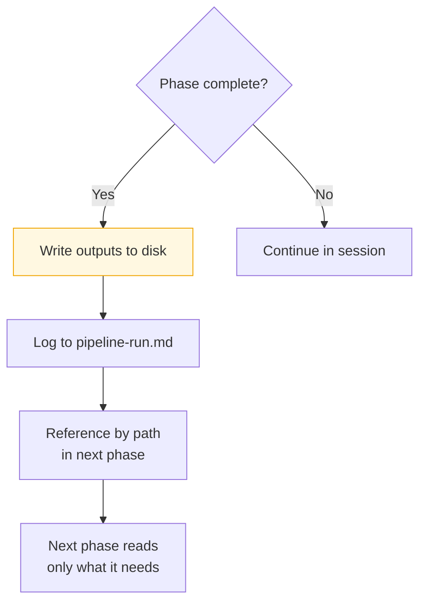

# Planifest - Agentic Tool Runbook

## Version Log

| Version | Change Description | Date | Changed By |
|---|---|---|---|
| 1 | Created from local dev runbook - expanded to cover Claude Code, Cursor, Antigravity, and GitHub Copilot | 05 MAR 2026 | Martin Mayer |
| 2 | Reframed for v1.0 skills-based delivery - pipeline-manifest.md replaced by orchestrator skill; MCP server setup replaced by direct file access; added Planifest name concept | 07 MAR 2026 | Martin Mayer (via agent) |
| 3 | MCP column in tool comparison table clarified as roadmap; context limit diagram updated to remove filesystem MCP reference | 12 MAR 2026 | Martin Mayer (via agent) |

---

> How to run the Planifest pipeline using each supported agentic development tool. v1.0 delivers the pipeline as Agent Skills - the orchestrator skill (`planifest-framework/skills/orchestrator/SKILL.md`) is the entry point. Tool-specific adapters in `planifest-framework/adapters/` load the skills via each tool's native compliance mechanism. MCP server infrastructure described in earlier versions of this document is a future roadmap item - see [RC-001](p014-planifest-roadmap.md) through [RC-004](p014-planifest-roadmap.md).

*Related: [Master Plan](p001-planifest-master-plan.md) | [Roadmap](p014-planifest-roadmap.md)*

---

## Table of Contents

- [1. The Pipeline Manifest - the shared source of truth](#1-the-pipeline-manifest--the-shared-source-of-truth)
- [2. Tool Comparison](#2-tool-comparison)
- [3. Claude Code](#3-claude-code)
- [4. Cursor](#4-cursor)
- [5. Antigravity](#5-antigravity)
- [6. GitHub Copilot](#6-github-copilot)
- [7. Hard Limits - all tools](#7-hard-limits--all-tools)
- [8. Context Limit Strategy](#8-context-limit-strategy)
- [9. Reconciling a Local Run with your VCS](#9-reconciling-a-local-run-with-your-vcs)

---

## 1. The Orchestrator Skill - the shared source of truth

`planifest-framework/skills/orchestrator/SKILL.md` is the entry point for all Planifest work, regardless of which agentic tool is used. It defines the coaching conversation, the pipeline phases, their sequencing, and the hard limits. Every tool loads this skill (or its tool-specific adapter) and follows it. The runtime differs; the steps do not.

The orchestrator skill:
- Assesses the Initiative Brief against what a complete Planifest specification requires
- Coaches the human through gaps - one question at a time, in priority order
- Produces the validated **Planifest** (`plan/{initiative-id}/planifest.md`) - the plan for what will be built and the manifest of what it builds against
- Sequences the phase skills: spec-agent -> adr-agent -> codegen-agent -> validate-agent -> security-agent -> docs-agent

For changes to existing initiatives, the orchestrator invokes the change-agent skill instead of the full pipeline.

---

## 2. Tool Comparison

| Concern | Claude Code | Cursor | Antigravity | GitHub Copilot |
|---|---|---|---|---|
| MCP support | Native - stdio *(roadmap - see RC-001 to RC-004)* | Via MCP extension *(roadmap)* | Native *(roadmap)* | Limited / via extensions *(roadmap)* |
| Authentication | Claude Code session - no API key needed | API key or Cursor account | Antigravity account | GitHub account |
| Runs full pipeline | Yes - loads orchestrator skill, executes phases | Yes - with adapter + skills | Yes - pipeline-native | Partial - prompt-driven per phase |
| Domain Knowledge Store | Reads `docs/` folder directly | Reads `docs/` folder directly | Reads `docs/` folder directly | Reads `docs/` folder via workspace indexing |
| PR creation | Manual push + pipeline-run.md | Manual push + pipeline-run.md | Native | Via CLI or extension |
| Rules file | `planifest-framework/adapters/claude-code/CLAUDE.md` | `planifest-framework/adapters/cursor/.cursorrules` | Antigravity config | `planifest-framework/adapters/copilot/copilot-instructions.md` |
| Context management | Manual chunking per session | Per-file context, references by path | Managed by Antigravity | Limited - per-file or workspace |
| Hard limits enforced | Prompt-level + PR gate | Prompt-level + PR gate | Prompt-level + PR gate | Prompt-level + PR gate |

---

## 3. Claude Code

Claude Code is one of the supported local runtimes. It loads the orchestrator skill via `planifest-framework/adapters/claude-code/CLAUDE.md`, which points it at the skill set.

### Setup

The adapter file is loaded automatically when Claude Code opens the project root. No MCP servers are required for v1.0 - the agent reads and writes files directly.

### Running the initiative pipeline

Paste this instruction into Claude Code:

```
Load the Planifest orchestrator skill at planifest-framework/skills/orchestrator/SKILL.md and execute the Initiative Pipeline.

Initiative brief: plan/{{initiative_id}}/initiative-brief.md
Initiative ID: {{initiative_id}}
Adoption mode: greenfield | retrofit | agent-interface
```

The orchestrator will assess the brief, coach you through any gaps, produce the Planifest, and then sequence through the phase skills.

### Running the change pipeline

```
Load the Planifest orchestrator skill at planifest-framework/skills/orchestrator/SKILL.md and execute the Change Pipeline.

Initiative ID: {{initiative_id}}
Component ID: {{component_id}}
Change request: {{description}}
```

### pipeline-run.md

Claude Code writes `pipeline-run.md` at the component root after every local run. This replaces the PR description for local sessions and serves as the audit trail.

```markdown
# Pipeline Run - {{initiative_id}}
Date: {{timestamp}}
Tool: Claude Code (local)

## Phases completed
- [x] Specification
- [x] ADRs (n generated)
- [x] Code generation
- [x] Validation (n self-correct cycles)
- [x] Security review
- [x] Docs sync

## Self-correct log
(what failed and how it was fixed)

## Quirks
(anything unusual noticed during the run)

## Recommended improvements
(what should be reviewed before the PR)

## Next step
git push origin initiative/{{initiative_id}}
```

---

## 4. Cursor

Cursor loads the Planifest framework via `planifest-framework/adapters/cursor/.cursorrules`, which points it at the orchestrator skill and encodes the hard limits.

### Setup

Copy or symlink the adapter file to the monorepo root:

```bash
cp planifest-framework/adapters/cursor/.cursorrules .cursorrules
```

Cursor loads `.cursorrules` automatically. No MCP servers are required for v1.0.

### Running the pipeline

Open Cursor at the monorepo root. The `.cursorrules` file is loaded automatically. Give the same instruction as Claude Code - the orchestrator skill will guide the process.

---

## 5. Antigravity

Antigravity is a pipeline-native agentic tool - it is designed to run multi-step agent workflows, making it a natural fit for the Planifest pipeline. The orchestrator skill maps directly to an Antigravity workflow definition.

### Setup

Configure Antigravity to point at the monorepo root. The adapter at `planifest-framework/adapters/antigravity/planifest.yaml` maps the skill set to Antigravity's workflow format.

*Antigravity configuration detail to be completed as the integration is built.*

### Running the pipeline

Antigravity reads the workflow config and sequences the phase skills. Each phase becomes a workflow step. Antigravity manages step sequencing, retries, and state persistence natively - removing the need for manual phase management that Claude Code and Cursor require. This makes Antigravity the closest to the future CI platform model in the local tool set.

---

## 6. GitHub Copilot

GitHub Copilot has more limited agent capabilities than the other tools in this set. The Planifest framework can be applied with Copilot, but with constraints:

- Hard limits are enforced via the instructions file and human discipline rather than structurally
- The Domain Knowledge Store is not queryable via tools - agents must read the `docs/` folder directly or rely on Copilot's workspace indexing
- The pipeline runs phase by phase with explicit prompting per phase rather than skill-driven execution

### Setup

Copy or symlink the adapter file:

```bash
cp planifest-framework/adapters/copilot/copilot-instructions.md .github/copilot-instructions.md
```

### Running the pipeline

With Copilot, the pipeline phases are run manually - prompt Copilot for each phase in sequence, referencing the orchestrator skill for the correct inputs, outputs, and instructions. The hard limits in the instructions file constrain what Copilot will do, but enforcement is prompt-level rather than structural.

---

## 7. Hard Limits - all tools

These apply regardless of which tool is used. In v1.0, enforcement is via the Agent Skills (prompt-level constraints) and human review at the PR gate. When MCP servers are built (see [Roadmap](p014-planifest-roadmap.md)), tools with MCP support will additionally enforce these at the infrastructure level.

| Hard Limit | v1.0 Enforcement |
|---|---|
| Spec must be complete before codegen | Agent skill instruction + human gate |
| No direct schema modification | Agent writes migration proposal + stops. Human reviews at PR gate |
| Destructive schema ops require human approval | Agent writes migration proposal flagged as destructive + stops |
| Data contract owned by one component | Agent checks data contract before writing. Human verifies at PR gate |
| Code and docs committed atomically | Agent skill instruction. Human verifies at PR gate |
| Credentials never in agent context | Credentials managed by OS / CI - never in prompts or files |

---

## 8. Context Limit Strategy

Applies to all local tools. The file system is the memory - write outputs to disk after each phase and reference them by path rather than holding everything in context.



**Practical rules:**
- Write and reference, don't repeat - outputs go to disk after each phase; the next phase reads by path
- Chunk large codegen - scaffold first, then implement routes, then tests, then IaC
- Summarise completed phases - once a phase is written and logged, drop it from active context
- If context runs out mid-phase - commit what exists, start a new session, and resume from `pipeline-run.md`; the phase structure makes this clean

---

## 9. Reconciling a Local Run with your VCS

A local run produces a local branch with the same files a CI platform run would produce. The final step is pushing and opening a PR.

```bash
# Review what was produced
cat plan/{{initiative_id}}/pipeline-run.md

# Run the same checks the CI platform will run
npm run ci:full --workspace=src/{{component_id}}

# Push and open PR - GitHub
git push origin initiative/{{initiative_id}}
gh pr create --title "feat: {{initiative_id}}" --body "$(cat plan/{{initiative_id}}/pipeline-run.md)"

# Push and open MR - GitLab
git push origin initiative/{{initiative_id}}
glab mr create --title "feat: {{initiative_id}}" --description "$(cat plan/{{initiative_id}}/pipeline-run.md)"
```

The CI platform runs the same checks on the PR. If they pass, the output is identical in quality to a full CI platform run. If they fail, the change pipeline self-corrects on the runner as normal.
