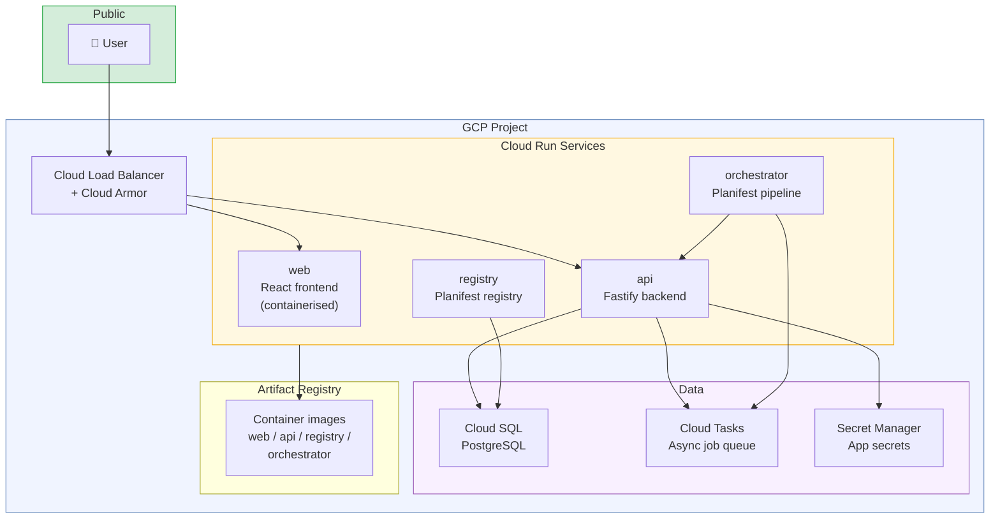
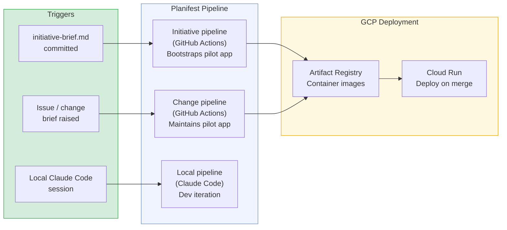

# Planifest Pilot App


---

> The first initiative built and maintained by Planifest, using Planifest. Purpose TBC - this document covers the confirmed technical decisions and will be updated when the product scope is defined.

*Related: [Master Plan](p001-planifest-master-plan.md) | [Product Concept](p002-planifest-product-concept.md) | [Roadmap](p014-planifest-roadmap.md)*

---

## Table of Contents

- [1. Status](#1-status)
- [2. Confirmed Technical Decisions](#2-confirmed-technical-decisions)
- [3. GCP Architecture](#3-gcp-architecture)
- [4. Monorepo Structure](#4-monorepo-structure)
- [5. CI/CD Pipeline](#5-cicd-pipeline)
- [6. What Happens When Purpose is Confirmed](#6-what-happens-when-purpose-is-confirmed)

---

## 1. Status

| Decision | Status |
|---|---|
| Application purpose | ⏳ TBC |
| Frontend stack | ✅ React 19 + TypeScript + shadcn/ui |
| Backend stack | ✅ Node.js + TypeScript |
| CI/CD platform | ✅ GitHub Actions |
| Source control | ✅ GitHub |
| Cloud provider | ✅ GCP |
| Compute | ✅ Cloud Run |
| Database | ✅ Cloud SQL (PostgreSQL) |
| Queue | ✅ Cloud Tasks |
| Container registry | ✅ Artifact Registry |
| Secrets | ✅ Secret Manager |
| IaC | ✅ Pulumi (TypeScript) |

---

## 2. Confirmed Technical Decisions

### Frontend
React 19 with TypeScript, Vite, Tailwind CSS, and shadcn/ui. Served as a containerised static build via Cloud Run - no CDN required at pilot scale, but the container approach makes it straightforward to add one later.

This is a pilot decision, not a Planifest default. The [Frontend Stack Evaluation](p016-planifest-frontend-stack-evaluation.md) assessed 10 frontend frameworks for agent-generated code and found React 19 + Vite + TypeScript the clear leader - 70-80% first-pass functional success rate, the deepest agent skills ecosystem, and the broadest component library coverage. The evaluation recommends specifying shadcn/ui as the component library, TanStack Query + Zustand for state management, and React Hook Form + Zod for form handling - these constrain the codegen-agent's output and reduce visual inconsistency.

### Backend
Node.js with Fastify and TypeScript. Fastify's native JSON Schema validation pairs cleanly with the OpenAPI-first approach Planifest uses - the spec defines the contract, Fastify validates against it at runtime. Shared types via Zod schemas in a `packages/shared` workspace.

This is a pilot decision, not a Planifest default. The [Backend Stack Evaluation](p013-planifest-backend-stack-evaluation.md) assessed 13 frameworks for agent-generated code and found Node.js/TypeScript + Fastify defensible for single-language simplicity, SDK coverage (~95%), and LLM fluency - but noted trade-offs in error handling discipline and type system soundness. For future initiatives, especially those with security-critical or high-performance components, the evaluation recommends considering Go (highest first-pass success rate) or Rust (strongest compile-time guarantees).

### Database
PostgreSQL via Cloud SQL. Drizzle ORM for type-safe queries - no raw SQL, schema migrations tracked in the repo.

### Source Control & CI
GitHub monorepo. GitHub Actions for CI/CD - the reference implementation Planifest is built and validated against first.

### Cloud
GCP throughout. See [3. GCP Architecture](#3-gcp-architecture) for the service map.

### IaC
Pulumi with TypeScript. Consistent with the rest of the stack - one language for application code and infrastructure. The Pulumi stack will be parameterised for environment (dev / staging / prod) from day one.

---

## 3. GCP Architecture



### Service decisions

**Cloud Run** is the right choice for this pilot for three reasons: no cluster management (no GKE overhead at this stage), scales to zero when idle (cost-efficient while usage is low), and the containerised deployment model is portable - if the pilot outgrows Cloud Run, migrating to GKE is a container re-target, not a rewrite.

**Cloud SQL** over a managed serverless option (Firestore, Spanner) because the stack is PostgreSQL + Drizzle throughout Planifest's architecture. Consistency matters more than marginal operational savings at pilot scale.

**Cloud Tasks** for async work - background jobs, long-running pipeline steps, webhook processing. Keeps the API response times predictable.

**Cloud Armor** on the load balancer from day one - lightweight WAF rules, not complex security theatre. Easier to have it in place than to retrofit.

### Environments

| Environment | Cloud Run config | Cloud SQL | Notes |
|---|---|---|---|
| dev | Min instances: 0, scale to 1 | Shared dev instance | Deployed on every push to `main` |
| staging | Min instances: 1 | Dedicated instance | Deployed on release tag |
| prod | Min instances: 1, scale to N | Dedicated instance, HA | Manual promotion from staging |

---

## 4. Monorepo Structure

The pilot app lives inside the Planifest monorepo as its first initiative - eating our own cooking from day one.

```
monorepo/
├── planifest/
│   ├── skills/                # Agent Skills - the Planifest pipeline
│   │   ├── orchestrator/SKILL.md
│   │   ├── spec-agent/SKILL.md
│   │   ├── adr-agent/SKILL.md
│   │   ├── codegen-agent/SKILL.md
│   │   ├── validate-agent/SKILL.md
│   │   ├── security-agent/SKILL.md
│   │   ├── docs-agent/SKILL.md
│   │   ├── change-agent/SKILL.md
│   │   └── shared/
│   │       └── default-rules.md
│   ├── adapters/
│   │   ├── claude-code/CLAUDE.md
│   │   ├── cursor/.cursorrules
│   │   ├── copilot/copilot-instructions.md
│   │   └── antigravity/planifest.yaml
│   └── templates/             # Artifact templates
│
├── plan/
│   └── pilot/                 # ← The pilot initiative lives here
│       ├── design.md          # Confirmed design and build plan
│       ├── feature-brief.md
│       ├── iteration-log.md   # Latest pipeline run log
│       └── docs/              # Full artifact set per FD-019
│           ├── design-spec.md
│           ├── openapi-spec.yaml
│           ├── domain-glossary.md
│           ├── risk-register.md
│           ├── scope.md
│           ├── operational-model.md
│           ├── slo-definitions.md
│           ├── cost-model.md
│           ├── security-report.md
│           ├── recommendations.md
│           └── adr/
│
├── src/
│   └── pilot/                 # ← The pilot implementation lives here
│       ├── component.json     # Component manifest
│       ├── apps/
│       │   ├── web/           # React + TypeScript + Vite + TailwindCSS
│       │   └── api/           # Fastify + TypeScript
│       ├── packages/
│       │   └── shared/        # Zod schemas, types, API contracts
│       ├── infra/             # Pulumi - Cloud Run, Cloud SQL, Cloud Tasks
│       └── docs/              # Component-level artifacts
│           ├── purpose.md
│           ├── interface-contract.md
│           ├── data-contract.md
│           ├── quirks.md
│           └── migrations/
│
├── docs/                      # Repo-wide state
│   ├── component-registry.md
│   └── dependency-graph.md
│
├── infra/
│   └── platform/
│       └── gcp/               # Shared Pulumi modules - Cloud Run, Cloud SQL, Artifact Registry
└── README.md
```

---

## 5. CI/CD Pipeline

The pilot uses GitHub Actions as the CI/CD platform - Planifest's reference implementation. Both the initiative pipeline (used once to bootstrap the pilot) and the change pipeline (used for every subsequent change) are stamped from Planifest's core templates.



### GitHub Actions workflow summary

The pilot's CI jobs run in this order on every PR:

1. **lint + typecheck** - both `apps/web` and `apps/api`, scoped via Nx affected
2. **unit tests** - Jest / Vitest
3. **integration tests** - API against a Cloud SQL dev instance (Cloud SQL Auth Proxy in the runner)
4. **container build** - multi-stage Docker builds for web and api, pushed to Artifact Registry
5. **deploy to dev** - Cloud Run revision deployed automatically on merge to `main`
6. **deploy to staging** - triggered on release tag, requires staging integration tests to pass

### GCP credentials in GitHub Actions

Service account key stored as a GitHub Actions secret. The service account has the minimum required roles: Cloud Run Developer, Cloud SQL Client, Artifact Registry Writer, Secret Manager Secret Accessor.

The Pulumi stack state is stored in a GCP Storage bucket rather than Pulumi Cloud - keeps everything within the GCP project boundary.

---

## 6. What Happens When Purpose is Confirmed

When the pilot's product scope is defined, a **Feature Brief** will be written and committed to the repo. Planifest will process it through the full initiative pipeline. The orchestrator begins **Phase 0 - Assess and Coach**. Development does not begin until the **design** (`plan/current/design.md`) is complete and **Planifest confirmed**. Humans retain approval at the PR, for any schema changes, and for any high/critical risk items.

1. **Phase 0** coaches for every answer needed - surfaces gaps before proceeding. Derives the **design.md**.
2. **spec-agent (Phase 1)** derives the detailed specification, OpenAPI definition, scope, risk register, and domain glossary.
3. **adr-agent (Phase 2)** generates ADRs for every significant decision.
4. **codegen-agent (Phase 3)** scaffolds the full implementation inside `src/pilot/`.
5. **validate loop (Phase 4)** runs CI and self-corrects.
6. **security-agent (Phase 5)** produces the security report.
7. **docs-agent (Phase 6)** opens the PR and syncs all artifacts.

### Targeted Modifications

Once the pilot components exist, future modifications (bugs, adjustments) that don't change intent will follow the **Change Pipeline**, bypassing the full Agentic Iteration Loop while still maintaining artifact consistency. Trivial UI or logic fixes follow the **Fast Path**.

The `component.json` for the pilot will be pre-seeded with the confirmed technical decisions from this document - stack, cloud provider, CI platform - so the agents don't need to derive them from the brief.

```json
{
  "id": "pilot",
  "type": "initiative",
  "initiative_mode": "greenfield",
  "status": "in-progress",
  "stack": {
    "frontend": "react19+typescript+vite+tailwind+shadcn-ui",
    "backend": "fastify+typescript",
    "database": "postgresql",
    "orm": "drizzle",
    "iac": "pulumi",
    "cloud": "gcp",
    "compute": "cloud-run",
    "ci": "github-actions"
  },
  "domain_knowledge_path": "plan/_archive/pilot/docs"
}
```

This pre-seeded manifest ensures the codegen-agent generates Cloud Run-compatible Dockerfiles and Pulumi stacks targeting GCP from the first run - without those decisions appearing in the brief itself.

---

*This document will be updated when the pilot purpose is confirmed.*

*[← All Components](vault-index.md) | [← Architecture](p001-planifest-master-plan.md) | [← Concept](p002-planifest-product-concept.md)*
