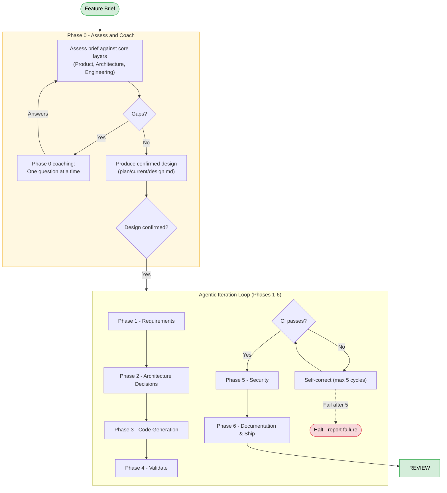
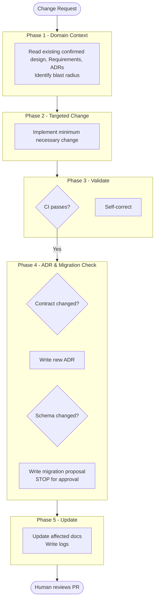

> The pipeline an agent follows to take a Feature Brief through to a production-ready, documented, tested pull request. This document is the reference description of the pipeline phases. The pipeline is delivered as a set of Agent Skills (see [FD-022](p003-planifest-functional-decisions.md#fd-022--planifest-is-delivered-as-agent-skills)) - the orchestrator skill (`planifest-framework/skills/planifest-orchestrator/SKILL.md`) is the entry point.

---

## How This Works

Planifest is a requirements framework. You - the agent - follow it. The requirements are the standard against which your output will be assessed.

The **confirmed design** (stored at `plan/current/design.md`) is the plan and the manifest: the plan is what will be built, the manifest is what it builds against. For every feature, you produce this design through a coaching conversation with the human. The human must grant **Design confirmed** status before any further work begins.

This document describes three execution tracks:
- **Fast Path**: For trivial UI or copy changes.
- **Change Pipeline**: For modifications to 1-2 existing components.
- **Feature Pipeline**: For new work or significant features.

---

## Three-Track Decision Tree

| Signal | Track |
|--------|-------|
| Confined to UI styling, copy/text changes, or an isolated pure-function bug | **Fast Path** - if ALL Fast Path criteria are met |
| Dependency version bump with no API changes | **Fast Path** - if ALL Fast Path criteria are met |
| Bug fix or targeted change to 1-2 existing components | **Change Pipeline** |
| Adds a new component to an existing feature | **Change Pipeline** |
| New user stories that fit within an existing feature's scope (< 3 stories) | **Change Pipeline** |
| New features, new user stories (≥ 3), or new problem statement | **Feature Pipeline** |
| Touches > 3 components or requires new infrastructure | **Feature Pipeline** |

### Fast Path Criteria

The Fast Path may ONLY be used if the request meets **ALL** of the following:
1. No new external dependencies.
2. No database schema or data model changes.
3. No changes to security, authentication, or routing.
4. Confined to: UI styling, copy changes, or isolated pure-function logic bugs.

---

## Feature Pipeline

Triggered for new features or large features.

---

### Phase 0 - Assess and Coach (Hard Gate)

**Purpose:** Reach a complete, **Design confirmed** state.

**Process:**
1. **Assess** the Feature Brief against the three layers:
   - **Product**: Functional Requirements. What the system must do and why.
   - **Architecture**: Standards. The cross-cutting rules and non-functional requirements.
   - **Engineering**: Implementation. How the system was actually built.
2. **Coach** the human through gaps one question at a time.
3. **Decompose** large features into small features (< 3 stories each).
4. **Produce** the confirmed design at `plan/current/design.md`.
5. **Gate:** Human must grant **Design confirmed** status before proceeding.

---

### Phase 1 - Requirements

**Skill:** `planifest-spec-agent`

**Purpose:** Produce the technical contract for the build.

**Outputs (write to `plan/current/`):**
- **Execution Plan**: The step-by-step build sequence.
- **OpenAPI Specification**: `openapi-spec.yaml` (if applicable).
- **Scope, Risk Register, Domain Glossary**.
- **Operational Model, SLO Definitions, Cost Model**.

---

### Phase 2 - Architecture Decisions

**Skill:** `planifest-adr-agent`

**Purpose:** Record every significant decision as an ADR.

**Output:** ADRs written to `plan/current/adr/ADR-{NNN}-{title}.md`.

---

### Phase 3 - Code Generation

**Skill:** `planifest-codegen-agent`

**Purpose:** Implement the system at `src/{component-id}/`.

**Includes:** Application code, shared types, tests, IaC, and Dockerfiles.

---

### Phase 4 - Validate

**Skill:** `planifest-validate-agent`

**Purpose:** CI checks (lint, typecheck, test, build).
**Rule:** Max 5 self-correction cycles before halting.

---

### Phase 5 - Security

**Skill:** `planifest-security-agent`

**Purpose:** Produce `plan/current/security-report.md` covering threat model, dependency audit, and auth/authz review.

---

### Phase 6 - Documentation and Ship

**Skill:** `planifest-docs-agent`

**Purpose:** Finalise the audit trail and update the living repository state.

**Outputs:**
- Update `src/{component-id}/component.yml`.
- Update global `docs/adr/` and `docs/migrations/`.
- Update `docs/component-registry.md` and `docs/dependency-graph.md`.
- `plan/changelog/{feature-id}-{YYYY-MM-DD}.md`.
- `plan/current/iteration-log.md`.

---

## Change Pipeline

Triggered for targeted modifications to existing work.

---

## Hard Limits

These apply in every session, every phase, every pipeline. Non-negotiable.

1. **Design must be confirmed before Phase 1 begins.**
2. **Requirements must be complete before Phase 3 begins.**
3. **No direct schema modification.** Migration proposals only.
4. **Destructive schema operations require human approval.**
5. **Data is owned by exactly one component.**
6. **Code and documentation are written together.**
7. **Credentials are never in context.**

---

## Adoption Modes

| Mode | Entry point | Phase 0/1 behaviour |
|---|---|---|
| **Greenfield** | Feature Brief | Assess from scratch, coach for completeness. |
| **Retrofit** | Existing codebase | Scan repo first. Infer architecture, generate initial ADRs. |
| **Agent Interface** | Interface spec | Scope coaching to the interface; build against the contract. |

---

*Related: [Master Plan](p001-planifest-master-plan.md) | [Functional Decisions](p003-planifest-functional-decisions.md) | [Hard Limits](GEMINI.md)*
