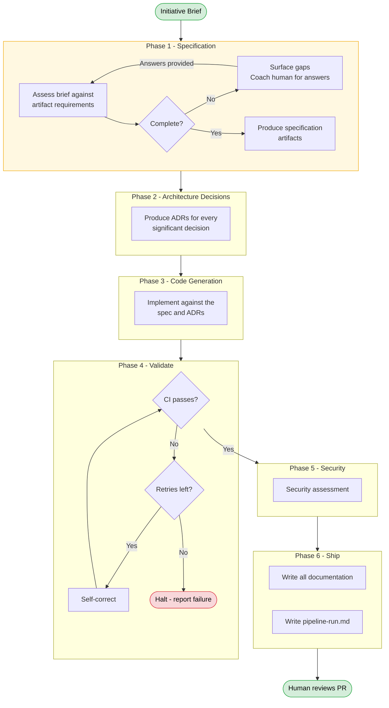
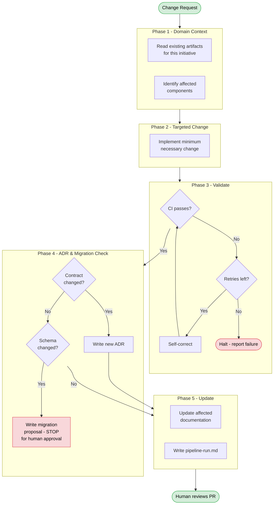

# p015-planifest-pipeline - Planifest Pipeline


---

> The pipeline an agent follows to take an Initiative Brief through to a production-ready, documented, tested pull request. This document is the reference description of the pipeline phases. The pipeline is delivered as a set of Agent Skills (see [FD-022](p003-planifest-functional-decisions.md#fd-022--planifest-is-delivered-as-agent-skills)) - the orchestrator skill (`planifest-framework/skills/orchestrator/SKILL.md`) is the entry point.

---

## How This Works

Planifest is a specification framework. You - the agent - follow it. The specification is the standard against which your output will be assessed.

A Planifest is the plan and the manifest: the plan is what will be built, the manifest is what it builds against. For every initiative, you produce a Planifest - a single document that records both. The human confirms it before development begins.

This document describes two pipelines: the **Initiative Pipeline** (new work) and the **Change Pipeline** (modifications to existing work). Both follow the same principle: understand the domain first, produce the specification, then build against it.

The human starts the process. You assess what they've provided, coach them through any gaps, then execute. The human reviews the result at the PR gate.

---

## Before Every Session

Regardless of which pipeline you are running:

1. Read this document fully
2. Read `planifest/hard-limits.md` - these are non-negotiable
3. Read `planifest/default-rules.md` - these govern your behaviour unless overridden per initiative
4. If an initiative already exists at `plan/`, read the existing artifacts to understand the current state

---

## Initiative Pipeline

Triggered when a human provides an Initiative Brief for new work.



---

### Phase 1 - Specification (hard gate)

**Purpose:** Ensure the specification is complete before any development begins. This is a hard gate - you do not proceed to Phase 2 until the spec is confirmed complete.

**Input:** Initiative Brief (provided by human)

**Process:**

Assess the Initiative Brief against the full artifact requirements defined in [FD-019](p003-planifest-functional-decisions.md#fd-019--artifact-types-are-distinct-and-independently-versioned). For each required artifact, determine whether the brief provides or implies enough information to produce it.

If the brief is complete - all required information is present or derivable - proceed to produce the specification artifacts.

If the brief has gaps - missing acceptance criteria, unspecified non-functional requirements, ambiguous scope boundaries, no stack declaration, missing risk considerations - surface them to the human. Be specific:

- State exactly what is missing
- State which artifact cannot be produced without it
- State why it matters (what goes wrong if you guess)

Wait for the human to provide the answers. Reassess. Repeat until complete.

You may make documented assumptions for genuinely minor gaps - record these in the Risk Register with `likelihood: medium` and flag them. You must not assume away significant ambiguity.

**Outputs - write each to `plan/current/` as you complete it:**

| Artifact | Path |
|---|---|
| Design Specification | `design-spec.md` |
| OpenAPI Specification | `openapi-spec.yaml` |
| Scope | `scope.md` |
| Risk Register | `risk-register.md` |
| Domain Glossary | `domain-glossary.md` |
| Operational Model | `operational-model.md` |
| SLO Definitions | `slo-definitions.md` |
| Cost Model | `cost-model.md` |

**Rules:**

- Derive functional requirements from user stories. Do not invent requirements not in the brief.
- Non-functional requirements must include specific, measurable targets - not vague statements.
- The OpenAPI spec must cover every endpoint implied by the functional requirements. Use OpenAPI 3.1.
- Load and use the domain glossary. If the brief introduces domain terms, define them. Never invent your own.
- Stack is a requirement. It must be explicitly declared. If the brief does not declare a stack, ask. Do not default one.
- Write each artifact to disk as you complete it. Do not accumulate them all in memory.

---

### Phase 2 - Architecture Decisions

**Purpose:** Record every significant decision as an ADR.

**Input:** Design Specification, OpenAPI Specification (from Phase 1)

**Process:**

For every significant decision - framework choice, database selection, auth strategy, deployment topology, queue vs sync, data ownership boundaries, component granularity - produce one ADR.

A significant decision is any choice that has consequences worth recording: what becomes easier, what becomes harder, what is deferred, what risk is introduced or mitigated.

**Output:** One ADR per decision, written to `plan/current/adr/ADR-{NNN}-{title}.md`

**ADR format:**

```markdown
# ADR-{NNN}: {title}

## Status
Accepted

## Context
Why this decision needed to be made.

## Decision
What was decided.

## Consequences
What becomes easier, what becomes harder, what is deferred.
```

**Rules:**

- Be specific. Vague ADRs are useless.
- Consequences must include at least one positive and one negative consequence.
- Do not write ADRs for decisions fixed by the stack declaration - those are already decided. Write one ADR that records the stack choice itself.
- Number sequentially from ADR-001.
- If a decision supersedes a prior ADR, mark the prior as `Superseded by ADR-{NNN}` and reference it in the new ADR's Context.

---

### Phase 3 - Code Generation

**Purpose:** Implement the system described by the specification and ADRs.

**Input:** Design Specification, OpenAPI Specification, ADRs, Stack Configuration

**Process:**

Read the full specification. Implement against it - not beyond it. The OpenAPI spec defines the contract. The ADRs define the decisions. The stack configuration defines the technology. Your job is to produce the implementation that satisfies these constraints.

**Output:** Full implementation at `src/{component-id}/`

This includes:

- Application source code (structure per the stack and ADRs)
- Shared types and validation schemas
- Unit tests, integration tests, and contract tests
- Infrastructure as Code (if declared in the stack)
- Dockerfiles and local dev configuration (if applicable)

**Rules:**

- Implement against the OpenAPI spec exactly. Do not add or remove endpoints.
- Use the domain glossary terms throughout - in code, comments, file names, and variable names.
- Every component that owns data must have a Data Contract. See [FD-016](p003-planifest-functional-decisions.md#fd-016--data-is-treated-differently-to-code).
- Write code incrementally. Scaffold first, then implement routes/handlers, then tests, then IaC. Write to disk after each stage.
- Do not introduce frameworks, libraries, or tools not declared in the stack configuration.
- If you encounter something that doesn't fit cleanly, write it to `src/{component-id}/docs/quirks.md` - do not silently work around it.

---

### Phase 4 - Validate and Self-Correct

**Purpose:** Confirm the implementation passes all checks.

**Process:**

Run the project's CI checks: linting, type-checking, tests, and builds. The specific commands depend on the stack - read the project's `package.json`, `Makefile`, or equivalent.

If checks pass -> proceed to Phase 5.

If checks fail -> read the error output, identify the root cause, fix it, and re-run. Maximum 5 self-correct cycles. If the issue persists after 5 attempts, halt and report:

- What failed
- What you tried
- Why it's not resolving

**Rules:**

- Fix the actual bug. Do not suppress linting rules or skip failing tests.
- If a test failure reveals a spec ambiguity, record it in `src/{component-id}/docs/quirks.md` and note it for the human.
- Track each self-correct cycle in your notes for inclusion in `pipeline-run.md`.

---

### Phase 5 - Security Assessment

**Purpose:** Produce a security assessment of the implementation.

**Input:** Full implementation (from Phase 3, validated in Phase 4)

**Output:** `plan/current/security-report.md`

**The security report must cover:**

- Threat model (STRIDE or equivalent - scoped to this component)
- Dependency audit (known vulnerabilities in declared dependencies)
- Secrets management (how secrets are handled - confirm none are hardcoded)
- Authentication and authorisation analysis
- Network policy review (what is exposed, what is internal)
- Input validation review (confirm all inputs are validated per the OpenAPI spec)

**Rules:**

- Every finding must reference a specific file, endpoint, or configuration. Generic security advice is not acceptable.
- Categorise findings by severity: critical, high, medium, low, informational.
- Critical and high findings should be flagged prominently - these will be reviewed at the PR gate.

---

### Phase 6 - Ship and Document

**Purpose:** Ensure all documentation is complete, consistent, and ready for human review.

**Process:**

1. Confirm every artifact defined in [FD-019](p003-planifest-functional-decisions.md#fd-019--artifact-types-are-distinct-and-independently-versioned) has been produced for this initiative
2. Produce per-component artifacts for each component:
   - `src/{component-id}/docs/purpose.md`
   - `src/{component-id}/docs/interface-contract.md`
   - `src/{component-id}/docs/dependencies.md`
   - `src/{component-id}/docs/data-contract.md` (if the component owns data)
   - `src/{component-id}/docs/risk.md`
   - `src/{component-id}/docs/scope.md`
   - `src/{component-id}/docs/quirks.md`
   - `src/{component-id}/docs/tech-debt.md`
3. Produce system-wide artifacts:
   - `docs/component-registry.md`
   - `docs/dependency-graph.md` (as a Mermaid diagram)
4. Produce `plan/current/recommendations.md` - suggested improvements for future iterations
5. Write `plan/changelog/{initiative-id}-<YYYY-MM-DD>.md` - the audit trail for this run

**`pipeline-run.md` format:**

```markdown
# Pipeline Run - {initiative-id}

Date: {timestamp}
Tool: {agent tool used}

## Phases completed
- [x] Specification
- [x] Architecture Decisions ({n} ADRs)
- [x] Code Generation
- [x] Validation ({n} self-correct cycles)
- [x] Security Assessment
- [x] Documentation

## Assumptions made
(any assumptions documented in the Risk Register)

## Quirks
(anything unusual discovered during the run)

## Recommendations
(what should be reviewed before merging)

## Self-correct log
(what failed during validation and how it was fixed)
```

---

## Change Pipeline

Triggered when a human requests a modification to an existing initiative.



---

### Phase 1 - Domain Context

**Purpose:** Understand the current state before changing anything.

**Process:**

Read the existing artifacts for this initiative:

1. `plan/current/design-spec.md` - understand the full specification
2. `docs/component-registry.md` - understand what components exist
3. `docs/dependency-graph.md` - understand how they relate
4. `src/{affected-component}/docs/` - read the purpose, interface contract, dependencies, data contract, risk, and quirks for every component the change touches
5. `plan/current/domain-glossary.md` - confirm you are using the correct terms

Identify which components are affected by the change request. Identify the blast radius - which other components depend on the ones you're changing.

---

### Phase 2 - Targeted Change

**Purpose:** Implement the minimum necessary change.

**Rules:**

- Do not refactor code outside the scope of the change request. Scope creep is a process violation.
- If the change touches data: read the Data Contract first. If schema changes are required, write a migration proposal and stop for human approval. This is a hard limit.
- If the change modifies an interface contract: note this - an ADR will be required in Phase 4.
- If the change request is ambiguous, implement the narrowest interpretation and document your reasoning.
- If you discover tech debt or quirks while working, write them to `src/{component-id}/docs/quirks.md` or raise them as recommendations - do not fix them as part of this change.

---

### Phase 3 - Validate

Same as Initiative Pipeline Phase 4. Scope checks to the blast radius of the change.

---

### Phase 4 - ADR & Migration Check

If the change modified an interface contract -> write a new ADR recording what changed, why, and the consequences for consumers.

If the change requires a schema modification -> write a migration proposal to `src/{component-id}/docs/migrations/proposed-{description}.md` and **stop**. A human must approve before any schema change is applied. This is a hard limit. See [FD-016](p003-planifest-functional-decisions.md#fd-016--data-is-treated-differently-to-code).

---

### Phase 5 - Update Documentation

Update every artifact affected by the change:

- Component purpose, interface contract, dependencies, risk, scope, quirks - if any changed
- System dependency graph - if component relationships changed
- Component registry - if a component was added, removed, or its summary changed
- Risk Register - if new risks were introduced
- Domain Glossary - if new terms were introduced
- ADRs - written in Phase 4 if needed

Write `pipeline-run.md` as the audit trail for this change.

---

## Hard Limits

These apply in every session, every phase, every pipeline. Non-negotiable. See [FD-007](p003-planifest-functional-decisions.md#fd-007--default-rules-are-conservative-autonomy-is-earned-progressively) for the full rules table.

The hard limits are:

1. **Specification must be complete before code generation begins.** If the spec has gaps, surface them and wait. Do not work around gaps by assuming.
2. **No direct schema modification.** If a change requires a schema change, write a migration proposal and stop for human approval. Never modify a schema directly.
3. **Destructive schema operations require human approval.** Drop column, drop table, rename - propose and stop. No exceptions.
4. **Data is owned by one component.** Never write to data owned by another component.
5. **Code and documentation are written together.** Never commit code without its documentation, or documentation without its code.
6. **Credentials are never in your context.** If a credential appears in a prompt, file, or environment, do not use it. Flag it.

---

## Artifact Templates

Use the templates in `planifest-framework/templates/` for every artifact you produce. The templates define the structure, the required sections, and the expected content. Do not invent your own structure - follow the template.

---

## Adoption Modes

The pipeline phases are the same regardless of adoption mode. What differs is the entry point and what Phase 1 looks like.

| Mode | Entry point | Phase 1 behaviour |
|---|---|---|
| **Greenfield** | Initiative Brief | Assess brief, coach for completeness, produce spec from scratch |
| **Retrofit** | Existing codebase + Initiative Brief | Read existing code first. Infer architecture, generate ADRs from what exists, surface drift and tech debt. Then assess the brief against the discovered reality. |
| **Agent Interface Layer** | Interface specification + Initiative Brief | Read the interface spec. Develop against the interface, not the internals. Keep context tightly scoped. |

See [FD-018](p003-planifest-functional-decisions.md#fd-018--planifest-supports-three-adoption-modes) for the full decision.

---

*Related: [Master Plan](p001-planifest-master-plan.md) | [Functional Decisions](p003-planifest-functional-decisions.md) | [Artifact Types - FD-019](p003-planifest-functional-decisions.md#fd-019--artifact-types-are-distinct-and-independently-versioned) | [Hard Limits - FD-007](p003-planifest-functional-decisions.md#fd-007--default-rules-are-conservative-autonomy-is-earned-progressively)*
