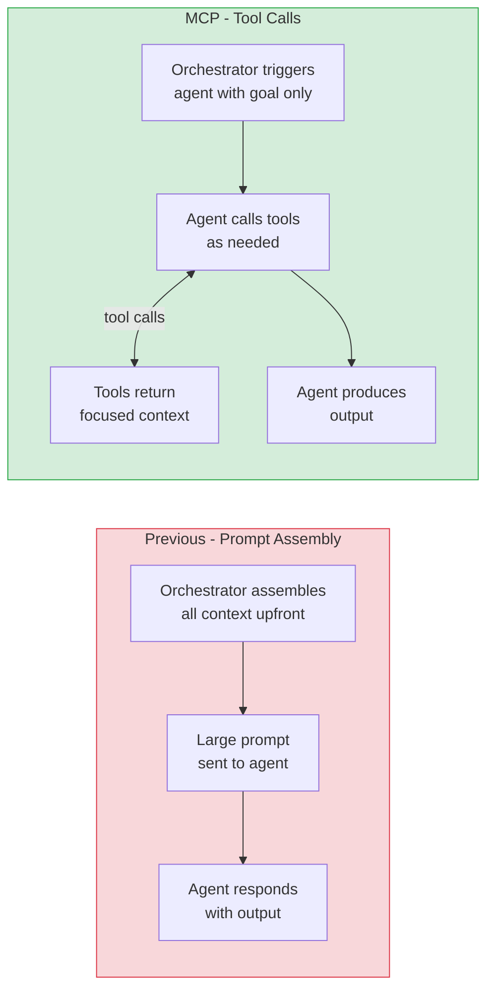
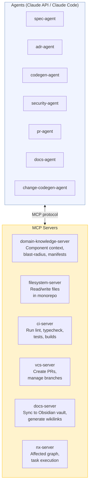
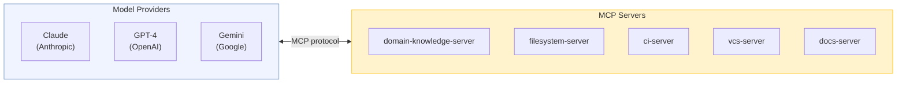
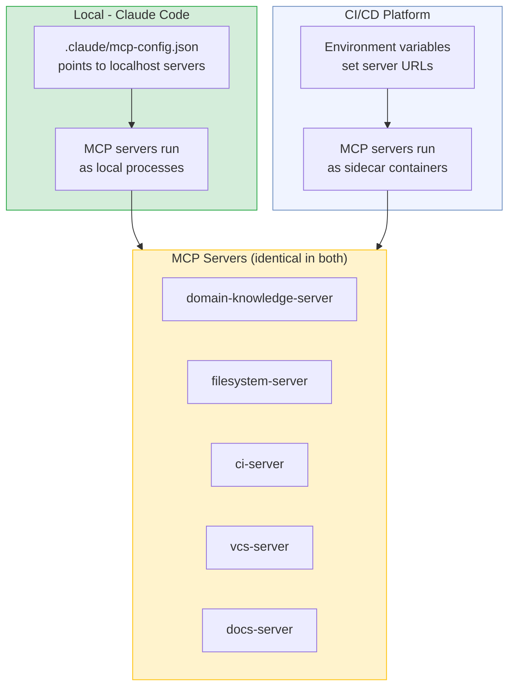
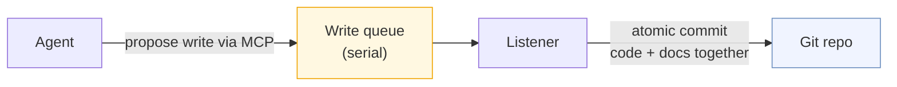

# Planifest - MCP Architecture


---

> **Status: Future architecture.** This document describes the target MCP service layer for Planifest. v1.0 operates without MCP services - agents read the `docs/` folder directly and write files to the local filesystem. The architecture described here becomes relevant when the roadmap items RC-001 (Domain Knowledge MCP Server), RC-003 (Serial Write Queue), and RC-004 (MCP Server Suite) are implemented. See [Roadmap](p014-planifest-roadmap.md).

> MCP is the standard protocol Planifest will use for agent tool access at scale. All pipeline capabilities - registry queries, file operations, CI execution, docs sync - would be exposed as MCP servers. Agents discover and call them at runtime rather than receiving pre-assembled context via prompts.

*Related: [Master Plan](p001-planifest-master-plan.md) | [Agent Prompt Library](p008-planifest-agent-prompt-library.md) | [Pipeline Template Reference](p009-planifest-pipeline-template-reference.md) | [Agentic Tool Runbook](p010-planifest-agentic-tool-runbook.md)*

---

## Table of Contents

- [1. Why MCP](#1-why-mcp)
- [2. MCP Architecture](#2-mcp-architecture)
- [3. MCP Servers in This Pipeline](#3-mcp-servers-in-this-pipeline)
- [4. Tool Definitions](#4-tool-definitions)
- [5. Provider Portability](#5-provider-portability)
- [6. Local vs CI Behaviour](#6-local-vs-ci-behaviour)
- [7. Implementation Notes](#7-implementation-notes)

---

## 1. Why MCP

The previous architecture had the orchestrator assembling all context - manifests, specs, ADRs, existing source - into a large prompt before each agent call. This meant the orchestrator needed to know in advance exactly what each agent would need. As pipeline complexity grows, that becomes brittle.

With MCP, agents pull the context they need via tool calls during their own reasoning. The orchestrator triggers the agent and provides a goal; the agent decides what to fetch. This makes agents more capable, prompts leaner, and the orchestrator simpler.



---

## 2. MCP Architecture



Each MCP server is a standalone service implementing the MCP specification. The implementation language is a stack decision - MCP SDKs exist for TypeScript, Python, Go, Rust, and others. Agents call them as tools during reasoning. In a CI/CD platform run, servers run as sidecar containers in the pipeline job. In Claude Code locally, servers run as local processes - Claude Code's native MCP support connects to them automatically via the `.claude/mcp-config.json` file.

---

## 3. MCP Servers in This Pipeline

### domain-knowledge-server

Exposes the component registry as MCP tools. Replaces the REST API for agent consumption - the REST API remains for non-agent consumers (Obsidian, dashboards).

**Tools exposed:**
- `get_component(id)` - full manifest for a component
- `get_component_context(id)` - manifest + direct dependents + dependencies
- `get_blast_radius(id)` - full transitive consumer graph
- `list_components()` - all components with summary fields
- `register_component(manifest)` - register a new component after scaffold
- `update_component(id, fields)` - update mutable manifest fields after merge

---

### filesystem-server

Controlled read/write access to the monorepo. Scoped to the current component's directory - agents cannot read or write outside their initiative path without explicit permission.

**Tools exposed:**
- `read_file(path)` - read a file by path
- `write_file(path, content)` - write or overwrite a file
- `list_files(directory)` - list files in a directory
- `file_exists(path)` - check if a file exists
- `read_openapi(component_id)` - convenience: read the OpenAPI spec for a component

---

### ci-server

Triggers CI checks and returns structured output. Used by the validate loop so agents can read error output directly without parsing shell output.

**Tools exposed:**
- `run_lint(component_id)` -> `{ passed: bool, errors: string[] }`
- `run_typecheck(component_id)` -> `{ passed: bool, errors: string[] }`
- `run_tests(component_id, scope?)` -> `{ passed: bool, failures: TestFailure[] }`
- `run_build(component_id)` -> `{ passed: bool, errors: string[] }`
- `run_sast(component_id)` -> `{ passed: bool, findings: Finding[] }`
- `run_full(component_id)` -> aggregated result of all above

---

### vcs-server

Wraps your version control platform's API for branch and PR/MR operations. Supports GitHub, GitLab, Bitbucket, and Azure DevOps. The tool interface is identical regardless of platform - the server handles the translation.

**Tools exposed:**
- `create_branch(name, base)` - create a feature branch
- `commit(message, paths)` - stage and commit specified files
- `push(branch)` - push branch to remote
- `create_pr(title, body, head, base)` - open a pull request or merge request (platform-normalised)
- `get_pr_status(branch)` - check if a PR/MR exists and its status
- `detect_platform()` - returns the current VCS platform (github | gitlab | bitbucket | azure-devops)

---

### docs-server

Handles documentation sync across pluggable provider backends. The docs-agent calls provider-agnostic tools; the server handles the translation to the configured target. The provider is set via the `DOCS_PROVIDER` environment variable.

**Supported providers:** `obsidian` (reference implementation) | `notion` | `confluence` | `markdown` (plain files / GitHub wiki)

**Tools exposed:**
- `sync_component_docs(component_id)` - place all docs in the correct location for the configured provider
- `generate_component_index(component_id)` - create or update the component entry point (vault page, Notion page, Confluence page, or index.md)
- `update_root_index()` - update the top-level index of all components
- `add_cross_references(file_path, links)` - insert cross-references in the provider's native link format (wikilinks, page links, anchor links)
- `get_provider()` - returns the active provider name - agents can call this to confirm configuration

**Provider config in `.env` / CI secrets:**
```bash
DOCS_PROVIDER=obsidian          # obsidian | notion | confluence | markdown
DOCS_ROOT=./docs/obsidian-vault # path or URL depending on provider
NOTION_TOKEN=...                # required if provider=notion
CONFLUENCE_TOKEN=...            # required if provider=confluence
```

---

### nx-server

Wraps the Nx project graph API for dependency awareness beyond what the registry provides - import-level relationships rather than declared manifest relationships.

**Tools exposed:**
- `get_affected(base, head)` - which projects are affected by a diff
- `get_project_graph()` - full Nx project graph
- `run_task(project, target)` - run an Nx task

---

## 4. Tool Definitions

MCP tools are defined using the MCP SDK for the chosen implementation language. Tool input and output schemas are defined in JSON Schema (see [Domain Knowledge Service Reference](p007-planifest-domain-knowledge-service-reference.md) for all schemas). Tool descriptions are written for the agent, not the developer - they explain *when* to use the tool, not just what it does.

All tool inputs must be validated against their JSON Schema before processing. All tool responses must conform to their response schema.

---

## 5. Provider Portability

Because the pipeline uses MCP, switching the underlying model provider requires no changes to the MCP servers or tool definitions. The agent changes; the tools do not.



The system prompts in [Agent Prompt Library](p008-planifest-agent-prompt-library.md) reference tool names (`get_component_context`, `write_file`, etc.) rather than API endpoints or prompt-assembled context blocks. Any MCP-compliant model can follow these instructions.

---

## 6. Local vs CI Behaviour

MCP server connectivity is configured differently per environment via `.claude/mcp-config.json` (local) and environment variables (CI). The servers themselves are identical.



**`.claude/mcp-config.json`** (committed to repo, used by Claude Code locally):

The `command` and `args` fields depend on the implementation language chosen for the MCP servers. The structure below shows the pattern - replace the command with whatever starts your server (e.g. `go run`, `python`, `npx tsx`, etc.).

```json
{
  "mcpServers": {
    "registry": {
      "command": "{{start-command}}",
      "args": ["apps/domain-knowledge-mcp/"],
      "env": { "REGISTRY_URL": "http://localhost:3000" }
    },
    "filesystem": {
      "command": "{{start-command}}",
      "args": ["apps/filesystem-mcp/"],
      "env": { "MONOREPO_ROOT": "." }
    },
    "ci": {
      "command": "{{start-command}}",
      "args": ["apps/ci-mcp/"]
    },
    "vcs": {
      "command": "{{start-command}}",
      "args": ["apps/vcs-mcp/"]
    },
    "docs": {
      "command": "{{start-command}}",
      "args": ["apps/docs-mcp/"],
      "env": { "DOCS_PROVIDER": "obsidian", "DOCS_ROOT": "./docs/obsidian-vault" }
    }
  }
}
```

---

## 7. Write Model & Security

### Serial write queue

The domain-knowledge-server is the **sole writer** to the git repository - for both code and docs. Agents never call git directly. All writes are posted to the server and processed serially - one at a time, in order - eliminating merge conflicts by design.



Code and docs are always committed in a single atomic operation. Neither is ever committed without the other. Direct git pushes by humans or external systems during active pipeline operation are a process violation.

### Credentials never in agent context

Agents are given a capability - "you can write to the document store" - not a credential. The domain-knowledge-server holds credentials; agents post writes to the service. Credentials are never present in the agent's context window regardless of how the agent is prompted.

In the non-MCP path, credentials are managed by the OS (macOS Keychain, Windows Credential Manager, Linux git credential store) or injected as masked environment variables in CI - again, never in the agent's context.

## 8. Implementation Notes

**SDK:** Use the official MCP SDK for the chosen implementation language. MCP SDKs are available for TypeScript, Python, Go, Rust, and others. The choice of language is a stack decision evaluated the same way as any other technology choice (see [Backend Stack Evaluation](p013-planifest-backend-stack-evaluation.md)).

**Transport:** Use `stdio` transport for local Claude Code (the default for Claude Code MCP). Use HTTP/SSE transport for CI/CD platform sidecar containers.

**Schemas:** All tool input and output schemas are defined in JSON Schema in the [Domain Knowledge Service Reference](p007-planifest-domain-knowledge-service-reference.md). Regardless of implementation language, all servers must validate against these schemas.

**Scoping:** The filesystem-server enforces path scoping - it will not read or write outside the monorepo root, and within a pipeline run it is further scoped to the current component's directory. This prevents agents from accidentally modifying other components.

**Error handling:** All tool responses include a `success` field. Agents are instructed in their system prompts to check this and handle failures explicitly rather than assuming success.

**Monorepo structure:** Each MCP server lives in `apps/[name]-mcp/`:

```
apps/
├── registry/          # REST API (for non-agent consumers)
├── domain-knowledge-mcp/      # MCP server wrapping registry
├── filesystem-mcp/    # MCP server for file operations
├── ci-mcp/            # MCP server for CI execution
├── vcs-mcp/           # MCP server for VCS operations
├── docs-mcp/          # MCP server for documentation sync (Obsidian, Notion, Confluence, Markdown)
└── nx-mcp/            # MCP server wrapping Nx
```
