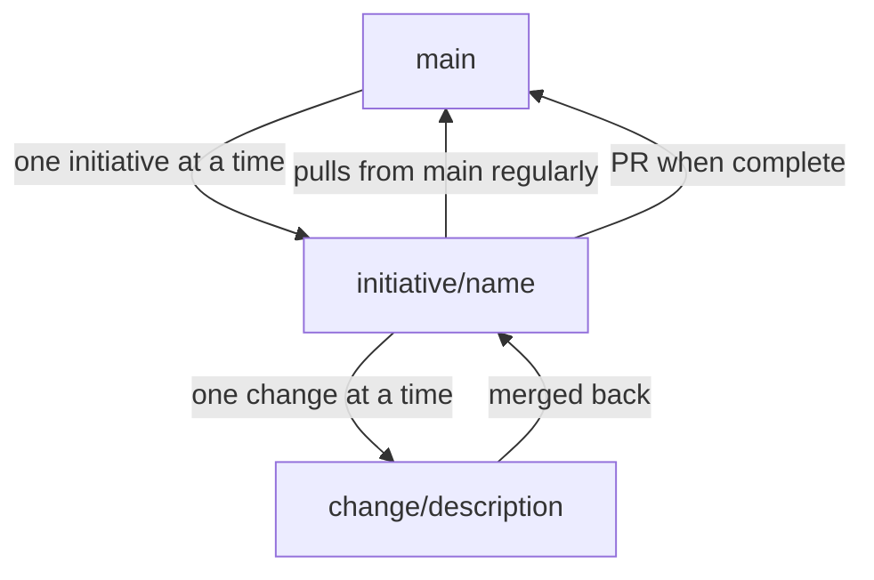

# Planifest - Domain Knowledge Service Reference Implementation


---

> **Status: Future architecture.** This document describes the reference implementation of the Domain Knowledge Service MCP server (roadmap items [RC-001](p014-planifest-roadmap.md) and [RC-003](p014-planifest-roadmap.md)). v1.0 operates with the git `docs/` path - agents read and write artifacts directly. The git write model, branching strategy, and serial queue described here become relevant when the service is implemented.

> The Planifest reference implementation of the MCP Domain Knowledge Service. This document describes how Planifest's own specification framework implements the interface - git-backed, serial queue, listener pattern. For the implementation-agnostic interface contract, see [Domain Knowledge Service Interface](p006-planifest-domain-knowledge-service-interface.md).

---

## Purpose

The MCP Domain Knowledge Service gives agents a structured, queryable view of everything Planifest knows about a system. Rather than loading entire documents into context, agents ask targeted questions and receive scoped, purposeful responses.

The service is a thin query layer over the document store. It does not make decisions - it surfaces knowledge. The agent decides what to do with it.

---

## Document Store Schema

Every document in the store conforms to a standard envelope. The content varies by document type; the envelope is always the same. All schemas are defined in JSON Schema - they are language-neutral and can be validated by any runtime.

```json
{
  "$id": "domain-document",
  "type": "object",
  "required": ["id", "type", "scope", "initiative", "version", "createdAt", "updatedAt", "author", "status", "content", "risk", "scope_boundaries"],
  "properties": {
    "id": {
      "type": "string",
      "description": "Unique document identifier, e.g. 'initiative:auth-service:design-spec'"
    },
    "type": {
      "type": "string",
      "enum": [
        "initiative-brief", "design-spec", "openapi-spec", "adr",
        "security-report", "risk-register", "scope", "quirks",
        "recommendations", "operational-model", "slo-definitions",
        "cost-model", "domain-glossary", "component-purpose",
        "interface-contract", "dependency-map", "test-coverage",
        "tech-debt", "component-registry", "dependency-graph"
      ]
    },
    "scope": {
      "type": "string",
      "enum": ["initiative", "component", "system"]
    },
    "initiative": {
      "type": "string",
      "description": "Initiative identifier"
    },
    "component": {
      "type": "string",
      "description": "Component identifier, if scoped to one"
    },
    "version": {
      "type": "string",
      "description": "Semver version"
    },
    "createdAt": {
      "type": "string",
      "format": "date-time"
    },
    "updatedAt": {
      "type": "string",
      "format": "date-time"
    },
    "author": {
      "type": "string",
      "enum": ["human", "agent"]
    },
    "status": {
      "type": "string",
      "enum": ["draft", "active", "superseded", "archived"]
    },
    "content": {
      "description": "Document content - shape varies by document type"
    },
    "risk": { "$ref": "#/$defs/risk-summary" },
    "scope_boundaries": { "$ref": "#/$defs/scope-boundaries" },
    "quirks": {
      "type": "array",
      "items": { "$ref": "#/$defs/quirk" }
    }
  }
}
```

### Cross-cutting Definitions

These appear in every document regardless of type:

```json
{
  "$defs": {
    "risk-summary": {
      "type": "object",
      "required": ["level", "items"],
      "properties": {
        "level": {
          "type": "string",
          "enum": ["low", "medium", "high", "critical"]
        },
        "items": {
          "type": "array",
          "items": { "$ref": "#/$defs/risk-item" }
        }
      }
    },
    "risk-item": {
      "type": "object",
      "required": ["id", "category", "description", "likelihood", "impact", "status"],
      "properties": {
        "id": { "type": "string" },
        "category": {
          "type": "string",
          "enum": ["technical", "operational", "security", "compliance"]
        },
        "description": { "type": "string" },
        "likelihood": {
          "type": "string",
          "enum": ["low", "medium", "high"]
        },
        "impact": {
          "type": "string",
          "enum": ["low", "medium", "high"]
        },
        "mitigation": { "type": "string" },
        "status": {
          "type": "string",
          "enum": ["open", "mitigated", "accepted"]
        }
      }
    },
    "scope-boundaries": {
      "type": "object",
      "required": ["in", "out", "deferred"],
      "properties": {
        "in": { "type": "array", "items": { "type": "string" } },
        "out": { "type": "array", "items": { "type": "string" } },
        "deferred": { "type": "array", "items": { "type": "string" } }
      }
    },
    "quirk": {
      "type": "object",
      "required": ["id", "description", "raisedBy", "raisedAt", "status"],
      "properties": {
        "id": { "type": "string" },
        "description": { "type": "string" },
        "workaround": { "type": "string" },
        "raisedBy": {
          "type": "string",
          "enum": ["human", "agent"]
        },
        "raisedAt": {
          "type": "string",
          "format": "date-time"
        },
        "status": {
          "type": "string",
          "enum": ["open", "resolved", "accepted"]
        }
      }
    }
  }
}
```

### Key Document Content Schemas

```json
{
  "$defs": {
    "component-purpose": {
      "type": "object",
      "required": ["summary", "systemContext", "type", "domain", "responsibilities", "notResponsibleFor"],
      "properties": {
        "summary": {
          "type": "string",
          "description": "One-liner: what this component exists to do"
        },
        "systemContext": {
          "type": "string",
          "description": "Where it sits in the wider system"
        },
        "type": {
          "type": "string",
          "enum": ["microservice", "microfrontend", "component-pack"]
        },
        "domain": {
          "type": "string",
          "description": "The domain it belongs to"
        },
        "responsibilities": {
          "type": "array",
          "items": { "type": "string" }
        },
        "notResponsibleFor": {
          "type": "array",
          "items": { "type": "string" },
          "description": "Explicit exclusions - equally important as responsibilities"
        }
      }
    },
    "interface-contract": {
      "type": "object",
      "required": ["inputs", "outputs", "schema", "consumedBy", "consumes", "breakingChangePolicy"],
      "properties": {
        "inputs": {
          "type": "array",
          "items": { "$ref": "#/$defs/contract-endpoint" }
        },
        "outputs": {
          "type": "array",
          "items": { "$ref": "#/$defs/contract-endpoint" }
        },
        "schema": {
          "type": "string",
          "description": "Reference to OpenAPI spec or Zod schema path"
        },
        "consumedBy": {
          "type": "array",
          "items": { "type": "string" },
          "description": "Component identifiers"
        },
        "consumes": {
          "type": "array",
          "items": { "type": "string" },
          "description": "Component identifiers"
        },
        "breakingChangePolicy": { "type": "string" }
      }
    },
    "adr-content": {
      "type": "object",
      "required": ["context", "decision", "status", "consequences"],
      "properties": {
        "context": { "type": "string" },
        "decision": { "type": "string" },
        "status": {
          "type": "string",
          "enum": ["proposed", "accepted", "deprecated", "superseded"]
        },
        "consequences": {
          "type": "array",
          "items": { "type": "string" }
        },
        "supersedes": {
          "type": "string",
          "description": "ADR id this supersedes"
        },
        "supersededBy": {
          "type": "string",
          "description": "ADR id that superseded this"
        }
      }
    },
    "component-registry-entry": {
      "type": "object",
      "required": ["id", "name", "type", "summary", "initiative", "status", "risk"],
      "properties": {
        "id": { "type": "string" },
        "name": { "type": "string" },
        "type": {
          "type": "string",
          "enum": ["microservice", "microfrontend", "component-pack"]
        },
        "summary": {
          "type": "string",
          "description": "One-liner"
        },
        "initiative": { "type": "string" },
        "status": {
          "type": "string",
          "enum": ["planned", "active", "deprecated"]
        },
        "risk": {
          "type": "string",
          "enum": ["low", "medium", "high", "critical"]
        }
      }
    }
  }
}
```

---

## Document Versioning

Documents are versioned. Updates create new versions rather than overwriting. History is never destroyed - only superseded. This mirrors how the git `docs/` fallback works naturally, and the MCP service versioning model follows the same principle.

```json
{
  "$id": "document-version",
  "type": "object",
  "required": ["version", "createdAt", "author", "changeSummary"],
  "properties": {
    "version": {
      "type": "string",
      "description": "Semver version"
    },
    "createdAt": {
      "type": "string",
      "format": "date-time"
    },
    "author": {
      "type": "string",
      "enum": ["human", "agent"]
    },
    "changeSummary": { "type": "string" },
    "previousVersion": {
      "type": "string",
      "description": "Version this supersedes"
    }
  }
}
```

The `status` field on the document envelope reflects the current state of a given version: `draft`, `active`, `superseded`, or `archived`. Querying the store always returns the `active` version unless a specific version is requested.

---

## MCP Tools

The service exposes the following tools to agents. Request and response shapes are defined in JSON Schema. Any MCP-compliant server - regardless of implementation language - must conform to these schemas.

---

### `domain_query`

The primary tool. Ask a natural language question about the domain; receive a structured, scoped answer with source references.

**Request:**
```json
{
  "type": "object",
  "required": ["question"],
  "properties": {
    "question": {
      "type": "string",
      "description": "Natural language question"
    },
    "scope": {
      "type": "object",
      "properties": {
        "initiative": { "type": "string" },
        "component": { "type": "string" },
        "documentTypes": {
          "type": "array",
          "items": { "type": "string" }
        }
      }
    },
    "maxResults": {
      "type": "integer",
      "default": 5
    }
  }
}
```

**Response:**
```json
{
  "type": "object",
  "required": ["answer", "confidence", "sources"],
  "properties": {
    "answer": {
      "type": "string",
      "description": "Synthesised answer in plain language"
    },
    "confidence": {
      "type": "string",
      "enum": ["high", "medium", "low"]
    },
    "sources": {
      "type": "array",
      "items": {
        "type": "object",
        "required": ["id", "type", "excerpt", "path"],
        "properties": {
          "id": { "type": "string" },
          "type": { "type": "string" },
          "excerpt": {
            "type": "string",
            "description": "The relevant passage"
          },
          "path": {
            "type": "string",
            "description": "Git docs path as fallback"
          }
        }
      }
    },
    "relatedQuestions": {
      "type": "array",
      "items": { "type": "string" },
      "description": "Suggested follow-up queries"
    }
  }
}
```

**Example:**

```json
{
  "question": "What components handle authentication?",
  "scope": { "initiative": "platform-v2" }
}
```

```json
{
  "answer": "Authentication is handled by the auth-service microservice. It is the sole component responsible for token issuance and validation. The api-gateway consumes it for all inbound requests. No other component performs auth logic - this is an explicit scope boundary in the auth-service design spec.",
  "confidence": "high",
  "sources": [
    {
      "id": "initiative:platform-v2:component:auth-service:purpose",
      "type": "component-purpose",
      "excerpt": "Sole responsibility for token issuance and validation across the platform.",
      "path": "docs/components/auth-service/purpose.md"
    },
    {
      "id": "initiative:platform-v2:component:auth-service:scope",
      "type": "scope",
      "excerpt": "Out of scope: any auth logic in downstream services.",
      "path": "docs/components/auth-service/scope.md"
    }
  ],
  "relatedQuestions": [
    "What are the SLO requirements for the auth-service?",
    "What ADRs exist for the auth strategy?"
  ]
}
```

---

### `get_component`

Retrieve the full domain record for a specific component.

**Request:**
```json
{
  "type": "object",
  "required": ["componentId"],
  "properties": {
    "componentId": { "type": "string" },
    "include": {
      "type": "array",
      "items": { "type": "string" },
      "description": "Document types to include. Default: all."
    }
  }
}
```

**Response:**
```json
{
  "type": "object",
  "required": ["component", "purpose", "contract", "risk", "scope", "quirks", "adrs", "techDebt"],
  "properties": {
    "component": { "$ref": "#/$defs/component-registry-entry" },
    "purpose": { "$ref": "#/$defs/component-purpose" },
    "contract": { "$ref": "#/$defs/interface-contract" },
    "risk": { "$ref": "#/$defs/risk-summary" },
    "scope": { "$ref": "#/$defs/scope-boundaries" },
    "quirks": {
      "type": "array",
      "items": { "$ref": "#/$defs/quirk" }
    },
    "adrs": {
      "type": "array",
      "items": { "$ref": "#/$defs/adr-content" }
    },
    "techDebt": {
      "type": "array",
      "items": { "type": "string" }
    }
  }
}
```

---

### `get_dependency_graph`

Return the dependency graph for an initiative or a named component, to a specified depth.

**Request:**
```json
{
  "type": "object",
  "required": ["initiative"],
  "properties": {
    "initiative": { "type": "string" },
    "rootComponent": {
      "type": "string",
      "description": "If omitted, returns full initiative graph"
    },
    "depth": {
      "type": "integer",
      "default": 2
    }
  }
}
```

**Response:**
```json
{
  "type": "object",
  "required": ["nodes", "edges"],
  "properties": {
    "nodes": {
      "type": "array",
      "items": { "$ref": "#/$defs/component-registry-entry" }
    },
    "edges": {
      "type": "array",
      "items": {
        "type": "object",
        "required": ["from", "to", "type", "contract"],
        "properties": {
          "from": { "type": "string", "description": "Component id" },
          "to": { "type": "string", "description": "Component id" },
          "type": {
            "type": "string",
            "enum": ["consumes", "produces", "publishes", "subscribes"]
          },
          "contract": {
            "type": "string",
            "description": "Interface contract id"
          }
        }
      }
    }
  }
}
```

---

### `list_adrs`

List ADRs across an initiative or component, optionally filtered by status.

**Request:**
```json
{
  "type": "object",
  "required": ["initiative"],
  "properties": {
    "initiative": { "type": "string" },
    "component": { "type": "string" },
    "status": {
      "type": "array",
      "items": {
        "type": "string",
        "enum": ["proposed", "accepted", "deprecated", "superseded"]
      }
    }
  }
}
```

**Response:**
```json
{
  "type": "object",
  "required": ["adrs"],
  "properties": {
    "adrs": {
      "type": "array",
      "items": {
        "type": "object",
        "required": ["id", "title", "status", "decision", "path"],
        "properties": {
          "id": { "type": "string" },
          "title": { "type": "string" },
          "status": {
            "type": "string",
            "enum": ["proposed", "accepted", "deprecated", "superseded"]
          },
          "decision": {
            "type": "string",
            "description": "One-line summary"
          },
          "path": { "type": "string" }
        }
      }
    }
  }
}
```

---

### `get_risk`

Surface all risk items for an initiative or component, optionally filtered by level or status.

**Request:**
```json
{
  "type": "object",
  "required": ["initiative"],
  "properties": {
    "initiative": { "type": "string" },
    "component": { "type": "string" },
    "level": {
      "type": "array",
      "items": { "type": "string", "enum": ["low", "medium", "high"] }
    },
    "status": {
      "type": "array",
      "items": { "type": "string", "enum": ["open", "mitigated", "accepted"] }
    }
  }
}
```

**Response:**
```json
{
  "type": "object",
  "required": ["summary", "items"],
  "properties": {
    "summary": { "$ref": "#/$defs/risk-summary" },
    "items": {
      "type": "array",
      "items": { "$ref": "#/$defs/risk-item" }
    }
  }
}
```

---

### `get_quirks`

Retrieve all known quirks for a scope, optionally filtered by status.

**Request:**
```json
{
  "type": "object",
  "required": ["initiative"],
  "properties": {
    "initiative": { "type": "string" },
    "component": { "type": "string" },
    "status": {
      "type": "array",
      "items": { "type": "string", "enum": ["open", "resolved", "accepted"] }
    }
  }
}
```

**Response:**
```json
{
  "type": "object",
  "required": ["quirks"],
  "properties": {
    "quirks": {
      "type": "array",
      "items": { "$ref": "#/$defs/quirk" }
    }
  }
}
```

---

### `raise_issue`

Allows an agent to raise a quirk, risk item, or tech debt entry - not just humans.

**Request:**
```json
{
  "type": "object",
  "required": ["initiative", "type", "description"],
  "properties": {
    "initiative": { "type": "string" },
    "component": { "type": "string" },
    "type": {
      "type": "string",
      "enum": ["quirk", "risk", "tech-debt"]
    },
    "description": { "type": "string" },
    "severity": {
      "type": "string",
      "enum": ["low", "medium", "high"]
    },
    "suggestedMitigation": { "type": "string" }
  }
}
```

**Response:**
```json
{
  "type": "object",
  "required": ["id", "status", "path", "requiresHumanReview"],
  "properties": {
    "id": { "type": "string" },
    "status": { "const": "logged" },
    "path": {
      "type": "string",
      "description": "Where it was written in the doc store"
    },
    "requiresHumanReview": {
      "type": "boolean",
      "description": "True if severity is high or critical"
    }
  }
}
```

---

### `get_glossary`

Retrieve the domain glossary for an initiative - the ubiquitous language agents must use when generating code, docs, and specs.

**Request:**
```json
{
  "type": "object",
  "required": ["initiative"],
  "properties": {
    "initiative": { "type": "string" },
    "term": {
      "type": "string",
      "description": "Lookup a specific term"
    }
  }
}
```

**Response:**
```json
{
  "type": "object",
  "required": ["terms"],
  "properties": {
    "terms": {
      "type": "array",
      "items": {
        "type": "object",
        "required": ["term", "definition", "usedIn"],
        "properties": {
          "term": { "type": "string" },
          "definition": { "type": "string" },
          "aliases": {
            "type": "array",
            "items": { "type": "string" }
          },
          "usedIn": {
            "type": "array",
            "items": { "type": "string" },
            "description": "Component ids where this term appears"
          }
        }
      }
    }
  }
}
```

---

## Write Tools

The service is symmetric - agents write to the domain knowledge store using the same service they query. Every write produces both a structured record and a markdown file at the corresponding git `docs/` path. The two are always kept in sync.

Agent writes are always flagged with `"author": "agent"`. Human reviewers can filter by this to audit what the pipeline has produced.

---

### `create_document`

Create a new document in the store. Validates against the document schema before accepting.

**Request:**
```json
{
  "type": "object",
  "required": ["type", "scope", "initiative", "content", "changeSummary"],
  "properties": {
    "type": { "type": "string", "description": "Document type" },
    "scope": { "type": "string", "enum": ["initiative", "component", "system"] },
    "initiative": { "type": "string" },
    "component": { "type": "string" },
    "content": { "description": "Document content - validated against the schema for the specified type" },
    "changeSummary": { "type": "string" }
  }
}
```

**Response:**
```json
{
  "type": "object",
  "required": ["id", "version", "path", "requiresHumanReview"],
  "properties": {
    "id": { "type": "string" },
    "version": { "type": "string" },
    "path": { "type": "string", "description": "Git docs path" },
    "requiresHumanReview": { "type": "boolean" }
  }
}
```

---

### `update_document`

Update an existing document. Creates a new version; the previous version is retained with status `superseded`.

**Request:**
```json
{
  "type": "object",
  "required": ["id", "content", "changeSummary"],
  "properties": {
    "id": { "type": "string" },
    "content": { "description": "Partial content update" },
    "changeSummary": { "type": "string" }
  }
}
```

**Response:**
```json
{
  "type": "object",
  "required": ["id", "previousVersion", "newVersion", "path", "requiresHumanReview"],
  "properties": {
    "id": { "type": "string" },
    "previousVersion": { "type": "string" },
    "newVersion": { "type": "string" },
    "path": { "type": "string" },
    "requiresHumanReview": { "type": "boolean" }
  }
}
```

---

### `supersede_adr`

Supersede an existing ADR with a new one. Links the old and new ADRs bidirectionally. The old ADR status is set to `superseded`; its history is retained.

**Request:**
```json
{
  "type": "object",
  "required": ["supersededId", "newAdr", "rationale", "initiative"],
  "properties": {
    "supersededId": { "type": "string", "description": "ADR being replaced" },
    "newAdr": { "$ref": "#/$defs/adr-content" },
    "rationale": { "type": "string", "description": "Why the decision changed" },
    "initiative": { "type": "string" },
    "component": { "type": "string" }
  }
}
```

**Response:**
```json
{
  "type": "object",
  "required": ["supersededId", "newId", "path", "requiresHumanReview"],
  "properties": {
    "supersededId": { "type": "string" },
    "newId": { "type": "string" },
    "path": { "type": "string" },
    "requiresHumanReview": {
      "const": true,
      "description": "Always true - ADR changes are significant"
    }
  }
}
```

---

### `raise_improvement`

Allows an agent to propose an improvement to the system, a component, or the domain model itself. By default, improvements always require human review - they change intent, and only a human can decide whether an improvement becomes an Initiative Brief.

This default is overridable per initiative.

**Request:**
```json
{
  "type": "object",
  "required": ["initiative", "title", "description", "rationale", "effort", "impact"],
  "properties": {
    "initiative": { "type": "string" },
    "component": { "type": "string" },
    "title": { "type": "string" },
    "description": { "type": "string" },
    "rationale": { "type": "string", "description": "Why this would be better" },
    "effort": { "type": "string", "enum": ["low", "medium", "high"] },
    "impact": { "type": "string", "enum": ["low", "medium", "high"] },
    "suggestedApproach": { "type": "string" },
    "relatedDocuments": {
      "type": "array",
      "items": { "type": "string" },
      "description": "Document ids"
    }
  }
}
```

**Response:**
```json
{
  "type": "object",
  "required": ["id", "status", "path", "requiresHumanReview"],
  "properties": {
    "id": { "type": "string" },
    "status": { "const": "logged" },
    "path": { "type": "string" },
    "requiresHumanReview": {
      "const": true,
      "description": "Always true by default"
    }
  }
}
```

---

## Database Tools

Data is treated differently to code throughout Planifest. A component can be rebuilt freely within its boundary - but the data it owns cannot. Schema changes require explicit migration plans, and certain operations are hard limits regardless of configuration.

### `get_data_contract`

Retrieve the canonical data contract for a component - the authoritative schema definition that the component owns.

**Request:**
```json
{
  "type": "object",
  "required": ["componentId", "initiative"],
  "properties": {
    "componentId": { "type": "string" },
    "initiative": { "type": "string" }
  }
}
```

**Response:**
```json
{
  "type": "object",
  "required": ["componentId", "owner", "schema", "invariants", "migrations"],
  "properties": {
    "componentId": { "type": "string" },
    "owner": {
      "type": "string",
      "description": "Component that owns this data - always one"
    },
    "schema": {
      "type": "object",
      "required": ["tables", "version", "path"],
      "properties": {
        "tables": {
          "type": "array",
          "items": {
            "type": "object",
            "required": ["name", "columns", "indexes", "relationships"],
            "properties": {
              "name": { "type": "string" },
              "columns": {
                "type": "array",
                "items": {
                  "type": "object",
                  "required": ["name", "type", "nullable", "constraints"],
                  "properties": {
                    "name": { "type": "string" },
                    "type": { "type": "string" },
                    "nullable": { "type": "boolean" },
                    "default": { "type": "string" },
                    "constraints": {
                      "type": "array",
                      "items": { "type": "string" }
                    }
                  }
                }
              },
              "indexes": {
                "type": "array",
                "items": { "type": "string" }
              },
              "relationships": {
                "type": "array",
                "items": {
                  "type": "object",
                  "required": ["type", "targetTable", "foreignKey"],
                  "properties": {
                    "type": {
                      "type": "string",
                      "enum": ["one-to-one", "one-to-many", "many-to-many"]
                    },
                    "targetTable": { "type": "string" },
                    "foreignKey": { "type": "string" }
                  }
                }
              }
            }
          }
        },
        "version": { "type": "string" },
        "path": {
          "type": "string",
          "description": "Path to full schema file"
        }
      }
    },
    "invariants": {
      "type": "array",
      "items": { "type": "string" },
      "description": "Rules the data must always satisfy"
    },
    "migrations": {
      "type": "array",
      "items": {
        "type": "object",
        "required": ["id", "version", "description", "status", "destructive"],
        "properties": {
          "id": { "type": "string" },
          "version": { "type": "string" },
          "description": { "type": "string" },
          "appliedAt": {
            "type": "string",
            "format": "date-time",
            "description": "Undefined if pending"
          },
          "status": {
            "type": "string",
            "enum": ["pending", "applied", "rolled-back"]
          },
          "destructive": {
            "type": "boolean",
            "description": "True if drops, renames, or type changes are involved"
          }
        }
      }
    }
  }
}
```

---

### `get_migration_history`

Return the full migration history for a component's data contract.

**Request:**
```json
{
  "type": "object",
  "required": ["componentId", "initiative"],
  "properties": {
    "componentId": { "type": "string" },
    "initiative": { "type": "string" },
    "status": {
      "type": "array",
      "items": { "type": "string", "enum": ["pending", "applied", "rolled-back"] }
    }
  }
}
```

**Response:**
```json
{
  "type": "object",
  "required": ["componentId", "migrations", "currentSchemaVersion"],
  "properties": {
    "componentId": { "type": "string" },
    "migrations": { "type": "array", "items": { "$ref": "#migration-summary" } },
    "currentSchemaVersion": { "type": "string" }
  }
}
```

---

### `propose_migration`

An agent proposes a schema migration before any schema change is applied. The migration plan is written to the doc store and flagged for human review. No schema change is applied until the migration is approved.

**Request:**
```json
{
  "type": "object",
  "required": ["componentId", "initiative", "description", "changes", "rationale", "rollbackPlan"],
  "properties": {
    "componentId": { "type": "string" },
    "initiative": { "type": "string" },
    "description": { "type": "string" },
    "changes": {
      "type": "array",
      "items": {
        "type": "object",
        "required": ["type", "target", "detail", "destructive"],
        "properties": {
          "type": {
            "type": "string",
            "enum": [
              "add-column", "add-table", "add-index",
              "modify-column", "rename-column", "rename-table",
              "drop-column", "drop-table"
            ]
          },
          "target": {
            "type": "string",
            "description": "Table or column name"
          },
          "detail": { "type": "string" },
          "destructive": { "type": "boolean" }
        }
      }
    },
    "rationale": { "type": "string" },
    "rollbackPlan": { "type": "string" }
  }
}
```

**Response:**
```json
{
  "type": "object",
  "required": ["id", "status", "path", "requiresHumanReview", "hardLimit"],
  "properties": {
    "id": { "type": "string" },
    "status": { "const": "proposed" },
    "path": { "type": "string" },
    "requiresHumanReview": {
      "const": true,
      "description": "Always - no exceptions"
    },
    "hardLimit": {
      "type": "boolean",
      "description": "True if destructive operations are present"
    }
  }
}
```

---

## Query Conventions

**Agents should query before generating.** Before building a component, the agent should at minimum:

1. `get_component` - understand what already exists in the vicinity
2. `domain_query` - confirm there is no existing component with overlapping responsibility
3. `get_risk` - understand what risk has already been identified for this domain
4. `get_glossary` - confirm it is using the correct ubiquitous language

**Queries should be scoped.** Unscoped queries return noisier results. Always pass `initiative` at minimum; pass `component` when working within a known boundary.

**Confidence matters.** A `low` confidence response means the domain knowledge store does not have a reliable answer. The agent should flag this rather than infer - and may raise an issue via `raise_issue` to surface the gap.

---

## Git `docs/` Path

For teams not running the MCP service, agents read documents directly from the git repository. The folder structure mirrors the document store schema, so agents can navigate it without the query service. No additional infrastructure is required.

This path suits smaller teams, single initiatives, or environments where running an additional service is not desirable. Both paths produce and consume the same document structure and honour the same default rules. The choice is operational, not architectural.

```
docs/
├── design-spec.md
├── openapi-spec.yaml
├── domain-glossary.md
├── risk-register.md
├── scope.md
├── quirks.md
├── recommendations.md
├── operational-model.md
├── slo-definitions.md
├── cost-model.md
├── adr/
│   └── 001-auth-strategy.md
├── components/
│   └── {component-id}/
│       ├── purpose.md
│       ├── interface-contract.md
│       ├── dependencies.md
│       ├── risk.md
│       ├── scope.md
│       ├── quirks.md
│       ├── tech-debt.md
│       ├── data-contract.md
│       ├── migrations/
│       │   └── 001-initial-schema.md
│       └── adr/
└── system/
    ├── component-registry.md
    └── dependency-graph.md
```

---

## Git Write Model

The MCP service is the sole writer to the git monorepo - for both code and docs. Agents never write to git directly. All writes are posted to the MCP service and queued for processing.

### Queue and Listener

When an agent posts an update, it is placed on a write queue. A listener processes the queue and triggers a function to commit and push the change. The queue is processed serially - one write at a time, in order. This eliminates merge conflicts by design.

### Branching Strategy



- **`main`** - the stable trunk. Agents never write here directly. Only merged into via PR.
- **`initiative/{name}`** - one branch per initiative, taken from main. One initiative is worked on at a time.
- **`change/{description}`** - each individual change is made on a branch off the initiative branch. One change at a time. Merged back into the initiative branch when complete.

Initiative branches pull from main regularly to stay current. This is a precaution - in normal operation there should be nothing to pull in, because the MCP service is the only writer.

### Atomic Commits

Code and docs are committed together in a single operation. A component without its documentation, or documentation without its code, is never a complete committed state.

### Conflict Prevention

Conflicts should not occur under normal operation. The serial queue, single-writer model, and one-change-at-a-time discipline make concurrent writes impossible within the pipeline.

Conflicts would only arise if:
- A human pushes directly to git outside the MCP service
- A secondary agentic system writes to git directly

Both are outside the Planifest model. Teams should treat direct git pushes by humans or external systems as a process violation during active pipeline operation.

---

## Non-MCP Git Path

For teams not running the MCP service, agents interact with git directly using the local environment. No custom infrastructure is required.

### Credential Handling

Credentials are never passed to or through the agent. The agent invokes git as a local process; the OS handles authentication natively:

- **macOS** - Keychain
- **Windows** - Windows Credential Manager
- **Linux** - git credential store or libsecret

In CI environments (GitHub Actions, GitLab CI etc.), credentials are injected as masked environment variables consumed by the git process directly. They are never present in the agent's context.

The agent is given a capability - "you can commit to git" - not a credential. It cannot share, leak, or expose authentication details regardless of how it is prompted, because they are not available to it.

### Behaviour

The same branching strategy and serial discipline applies as in the MCP path - one initiative branch, one change branch at a time, code and docs committed atomically. The difference is that the queue and listener are not present - the agent commits directly in sequence as part of its pipeline execution.

The non-MCP path is appropriate for:
- Local development
- Smaller teams with simpler workflows
- Environments where running an additional service is not desirable

---

## Default Rules

These rules govern how the service and the agents using it behave. See [FD-007 - Default rules](p003-planifest-functional-decisions.md#fd-007--default-rules-are-conservative-autonomy-is-earned-progressively) for the full default rules table. Rules marked **overridable** can be changed per initiative. Rules marked **hard limit** cannot - the consequences of getting them wrong are irreversible.

---

*Related: [Master Plan](p001-planifest-master-plan.md) | [The Pathway to Agentic Development](p004-the-pathway-to-agentic-development.md) | [Domain Knowledge Service Interface](p006-planifest-domain-knowledge-service-interface.md) | [Roadmap](p014-planifest-roadmap.md)*
