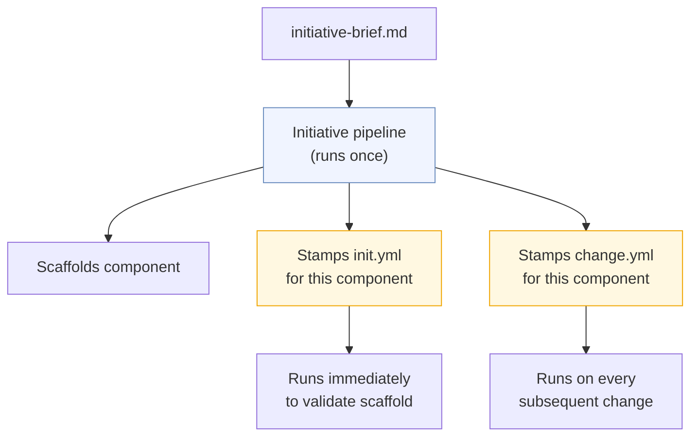
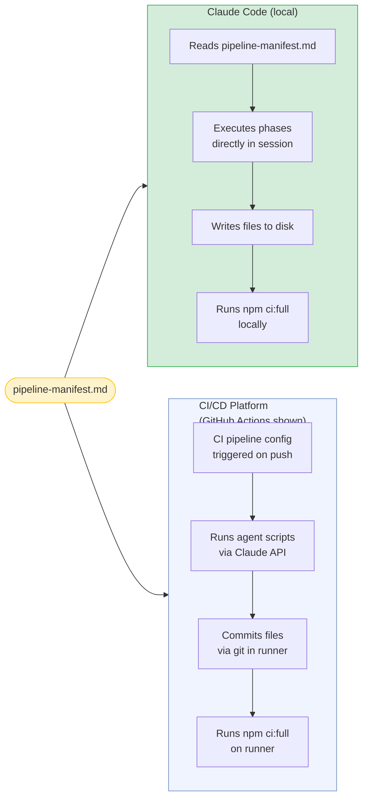

# Planifest - Pipeline Template Reference

## Version Log

| Version | Change Description | Date | Changed By |
|---|---|---|---|
| 1 | Initial document | 02 MAR 2026 | Martin Mayer |
| 2 | Added spec hard-gate job; added migration check phase; corrected human gate language | 05 MAR 2026 | Martin Mayer |
| 3 | Added future-state status marker - v1.0 uses standard CI (lint, typecheck, test, build); MCP sidecar and template stamping infrastructure are roadmap items RC-004 and RC-006 | 07 MAR 2026 | Martin Mayer (via agent) |

---

> **Status: Future architecture.** This document describes CI/CD pipeline templates that start MCP servers as sidecars and invoke agents via the Claude API. v1.0 does not use MCP sidecars or template stamping - the team writes standard CI config (lint, typecheck, test, build) and the agent executes pipeline phases locally via Agent Skills. The templates here become relevant when the Orchestrator Service ([RC-002](p014-planifest-roadmap.md)), MCP Server Suite ([RC-004](p014-planifest-roadmap.md)), and CI Pipeline Template Stamping ([RC-006](p014-planifest-roadmap.md)) are implemented.

> Planifest's pipeline templates are CI/CD platform-agnostic in logic. The examples here use GitHub Actions YAML as the reference implementation - the same phases apply to GitLab CI, Bitbucket Pipelines, CircleCI, Jenkins, and any other platform that supports job sequencing and artifact passing. Adapting to a different platform means translating the job structure, not changing the agent logic.

*Related: [Master Plan](p001-planifest-master-plan.md) | [Agent Prompt Library](p008-planifest-agent-prompt-library.md) | [Agentic Tool Runbook](p010-planifest-agentic-tool-runbook.md) | [MCP Design](p005-planifest-mcp-architecture.md)*

---

## Table of Contents

- [1. Overview](#1-overview)
- [2. Initiative Pipeline - Reference Implementation (GitHub Actions)](#2-initiative-pipeline-reference-implementation-github-actions)
- [3. Change Pipeline - Reference Implementation (GitHub Actions)](#3-change-pipeline-reference-implementation-github-actions)
- [4. Shared Reusable Workflows](#4-shared-reusable-workflows)
- [5. Secrets & Environment Variables](#5-secrets-environment-variables)
- [6. Template Stamping](#6-template-stamping)
- [7. Local Execution Mode](#7-local-execution-mode)

---

## 1. Overview

Each component gets two pipeline configs stamped into its `.github/workflows/` directory by the initiative pipeline at scaffold time. They are generated once and owned by the component from that point forward.



The templates are maintained in `apps/orchestrator/templates/`. When a template is updated, a migration script re-stamps affected component pipelines. The `pipeline.templateVersion` field in `component.json` tracks which version each component is on.

---

## 2. Initiative Pipeline - Reference Implementation (GitHub Actions)

This is the GitHub Actions reference implementation. The same phases apply on any CI platform - adapt the job syntax for your platform while keeping the phase order and MCP server startup pattern identical.

```yaml
name: Initiative Pipeline - {{component_id}}

on:
  workflow_dispatch:
    inputs:
      brief_path:
        description: Path to initiative-brief.md in the vault
        required: true
      component_id:
        description: Component identifier (kebab-case)
        required: true
      cloud_provider:
        description: Target cloud provider - gcp, aws, or azure
        required: true
        default: gcp

jobs:

  # ─── Phase 1: Specification ───────────────────────────────────────────────
  spec:
    name: Generate Design Spec
    runs-on: ubuntu-latest
    outputs:
      design_spec: ${{ steps.spec.outputs.design_spec }}
      openapi: ${{ steps.spec.outputs.openapi }}
      component_json: ${{ steps.spec.outputs.component_json }}
    steps:
      - uses: actions/checkout@v4

      - name: Read initiative brief
        id: brief
        run: echo "content=$(cat ${{ inputs.brief_path }} | base64 -w 0)" >> $GITHUB_OUTPUT

      - name: Run spec-agent
        id: spec
        uses: ./.github/actions/run-agent
        with:
          agent: spec-agent
          brief: ${{ steps.brief.outputs.content }}
          cloud_provider: ${{ inputs.cloud_provider }}
          anthropic_api_key: ${{ secrets.ANTHROPIC_API_KEY }}

      - name: Commit spec outputs
        run: |
          git config user.name "pipeline-bot"
          git config user.email "pipeline@internal"
          git checkout -b initiative/${{ inputs.component_id }}
          echo "${{ steps.spec.outputs.design_spec }}" | base64 -d \
            > initiatives/${{ inputs.component_id }}/docs/design-spec.md
          echo "${{ steps.spec.outputs.openapi }}" | base64 -d \
            > initiatives/${{ inputs.component_id }}/docs/openapi.yaml
          echo "${{ steps.spec.outputs.component_json }}" | base64 -d \
            > initiatives/${{ inputs.component_id }}/component.json
          git add . && git commit -m "feat({{component_id}}): add design spec and openapi"
          git push origin initiative/${{ inputs.component_id }}

  # ─── Phase 2: ADRs ────────────────────────────────────────────────────────
  adrs:
    name: Generate ADRs
    needs: spec
    runs-on: ubuntu-latest
    outputs:
      adrs: ${{ steps.adrs.outputs.adrs }}
    steps:
      - uses: actions/checkout@v4
        with:
          ref: initiative/${{ inputs.component_id }}

      - name: Run adr-agent
        id: adrs
        uses: ./.github/actions/run-agent
        with:
          agent: adr-agent
          design_spec: ${{ needs.spec.outputs.design_spec }}
          anthropic_api_key: ${{ secrets.ANTHROPIC_API_KEY }}

      - name: Commit ADRs
        run: |
          echo "${{ steps.adrs.outputs.adrs }}" | base64 -d \
            | node .github/scripts/write-adrs.js \
                --output initiatives/${{ inputs.component_id }}/docs/adr/
          git add . && git commit -m "feat({{component_id}}): add ADRs"
          git push origin initiative/${{ inputs.component_id }}

  # ─── Phase 3: Code Generation ─────────────────────────────────────────────
  codegen:
    name: Generate Implementation
    needs: [spec, adrs]
    runs-on: ubuntu-latest
    steps:
      - uses: actions/checkout@v4
        with:
          ref: initiative/${{ inputs.component_id }}

      - name: Run codegen-agent
        id: codegen
        uses: ./.github/actions/run-agent
        with:
          agent: codegen-agent
          design_spec: ${{ needs.spec.outputs.design_spec }}
          adrs: ${{ needs.adrs.outputs.adrs }}
          openapi: ${{ needs.spec.outputs.openapi }}
          component_id: ${{ inputs.component_id }}
          cloud_provider: ${{ inputs.cloud_provider }}
          anthropic_api_key: ${{ secrets.ANTHROPIC_API_KEY }}

      - name: Write generated files
        run: |
          echo "${{ steps.codegen.outputs.files }}" | base64 -d \
            | node .github/scripts/write-files.js

      - name: Commit implementation
        run: |
          git add . && git commit -m "feat({{component_id}}): generated implementation"
          git push origin initiative/${{ inputs.component_id }}

  # ─── Phase 4: Validate & Self-Correct ────────────────────────────────────
  validate:
    name: Validate & Self-Correct
    needs: codegen
    runs-on: ubuntu-latest
    steps:
      - uses: actions/checkout@v4
        with:
          ref: initiative/${{ inputs.component_id }}

      - uses: actions/setup-node@v4
        with:
          node-version: 20

      - name: Install dependencies
        run: npm ci

      - name: Self-correct loop
        # Retry up to 5 times within this job - no external state needed
        run: |
          MAX_RETRIES=5
          RETRY=0
          until npm run ci:full --workspace=initiatives/${{ inputs.component_id }} || \
                [ $RETRY -ge $MAX_RETRIES ]; do
            RETRY=$((RETRY + 1))
            echo "CI failed - retry $RETRY of $MAX_RETRIES"
            ERROR_OUTPUT=$(npm run ci:full \
              --workspace=initiatives/${{ inputs.component_id }} 2>&1 || true)

            # Call codegen-agent with error context
            node .github/scripts/self-correct.js \
              --component ${{ inputs.component_id }} \
              --error "$ERROR_OUTPUT" \
              --api-key ${{ secrets.ANTHROPIC_API_KEY }}

            git add . && git commit -m "fix({{component_id}}): self-correct retry $RETRY"
            git push origin initiative/${{ inputs.component_id }}
          done

          if [ $RETRY -ge $MAX_RETRIES ]; then
            echo "Max retries exceeded - pipeline halted"
            exit 1
          fi

  # ─── Phase 5: Security ────────────────────────────────────────────────────
  security:
    name: Security Assessment
    needs: validate
    runs-on: ubuntu-latest
    steps:
      - uses: actions/checkout@v4
        with:
          ref: initiative/${{ inputs.component_id }}

      - name: Run security-agent
        uses: ./.github/actions/run-agent
        with:
          agent: security-agent
          component_id: ${{ inputs.component_id }}
          design_spec: ${{ needs.spec.outputs.design_spec }}
          openapi: ${{ needs.spec.outputs.openapi }}
          anthropic_api_key: ${{ secrets.ANTHROPIC_API_KEY }}

      - name: Commit security report
        run: |
          git add initiatives/${{ inputs.component_id }}/docs/security-report.md
          git commit -m "docs({{component_id}}): add security report"
          git push origin initiative/${{ inputs.component_id }}

  # ─── Phase 6: PR & Docs ───────────────────────────────────────────────────
  ship:
    name: Create PR and Sync Docs
    needs: security
    runs-on: ubuntu-latest
    steps:
      - uses: actions/checkout@v4
        with:
          ref: initiative/${{ inputs.component_id }}

      - name: Run pr-agent
        id: pr
        uses: ./.github/actions/run-agent
        with:
          agent: pr-agent
          component_id: ${{ inputs.component_id }}
          anthropic_api_key: ${{ secrets.ANTHROPIC_API_KEY }}

      - name: Create GitHub PR
        run: |
          gh pr create \
            --title "feat: ${{ inputs.component_id }} - generated by initiative pipeline" \
            --body "${{ steps.pr.outputs.description }}" \
            --base main \
            --head initiative/${{ inputs.component_id }}
        env:
          GH_TOKEN: ${{ secrets.GITHUB_TOKEN }}

      - name: Run docs-agent and sync vault
        uses: ./.github/actions/run-agent
        with:
          agent: docs-agent
          component_id: ${{ inputs.component_id }}
          anthropic_api_key: ${{ secrets.ANTHROPIC_API_KEY }}

      - name: Register component in registry
        run: |
          curl -X POST ${{ secrets.REGISTRY_URL }}/components \
            -H "Content-Type: application/json" \
            -d @initiatives/${{ inputs.component_id }}/component.json
```

---

## 3. Change Pipeline - Reference Implementation (GitHub Actions)

Reference implementation for the change pipeline in GitHub Actions. The phase logic - context loading, targeted codegen, validate loop, ADR check, security, ship - is identical on all platforms.

```yaml
name: Change Pipeline - {{component_id}}

on:
  issues:
    types: [labeled]
  workflow_dispatch:
    inputs:
      change_brief:
        description: Change request description
        required: true

jobs:

  # ─── Load context from registry ───────────────────────────────────────────
  context:
    name: Load Component Context
    runs-on: ubuntu-latest
    outputs:
      manifest: ${{ steps.registry.outputs.manifest }}
      consumers: ${{ steps.registry.outputs.consumers }}
      blast_radius: ${{ steps.registry.outputs.blast_radius }}
      change_policy: ${{ steps.registry.outputs.change_policy }}
    steps:
      - name: Fetch component context
        id: registry
        run: |
          CONTEXT=$(curl -s ${{ secrets.REGISTRY_URL }}/components/{{component_id}}/context)
          echo "manifest=$(echo $CONTEXT | jq -r '.component' | base64 -w 0)" >> $GITHUB_OUTPUT
          echo "consumers=$(echo $CONTEXT | jq -r '.consumedBy' | base64 -w 0)" >> $GITHUB_OUTPUT
          BLAST=$(curl -s ${{ secrets.REGISTRY_URL }}/components/{{component_id}}/blast-radius)
          echo "blast_radius=$(echo $BLAST | base64 -w 0)" >> $GITHUB_OUTPUT
          echo "change_policy=$(echo $CONTEXT | jq -r '.component.changePolicy')" >> $GITHUB_OUTPUT

  # ─── Generate targeted change ─────────────────────────────────────────────
  codegen:
    name: Generate Change
    needs: context
    runs-on: ubuntu-latest
    outputs:
      contract_changed: ${{ steps.codegen.outputs.contract_changed }}
      adr_required: ${{ steps.codegen.outputs.adr_required }}
    steps:
      - uses: actions/checkout@v4

      - name: Run change-codegen-agent
        id: codegen
        uses: ./.github/actions/run-agent
        with:
          agent: change-codegen-agent
          component_id: "{{component_id}}"
          change_request: ${{ inputs.change_brief }}
          manifest: ${{ needs.context.outputs.manifest }}
          consumers: ${{ needs.context.outputs.consumers }}
          anthropic_api_key: ${{ secrets.ANTHROPIC_API_KEY }}

      - name: Write changed files
        run: |
          echo "${{ steps.codegen.outputs.files }}" | base64 -d \
            | node .github/scripts/write-files.js
          git checkout -b change/{{component_id}}/${{ github.run_id }}
          git add . && git commit -m "fix({{component_id}}): apply change"
          git push origin change/{{component_id}}/${{ github.run_id }}

  # ─── Validate (scope from blast-radius) ───────────────────────────────────
  validate:
    name: Validate
    needs: [context, codegen]
    runs-on: ubuntu-latest
    steps:
      - uses: actions/checkout@v4
        with:
          ref: change/{{component_id}}/${{ github.run_id }}

      - uses: actions/setup-node@v4
        with:
          node-version: 20

      - name: Install dependencies
        run: npm ci

      - name: Self-correct loop
        run: |
          MAX_RETRIES=5
          RETRY=0
          until npm run ci:scoped \
                  --workspace=initiatives/{{component_id}} \
                  --blast-radius='${{ needs.context.outputs.blast_radius }}' || \
                [ $RETRY -ge $MAX_RETRIES ]; do
            RETRY=$((RETRY + 1))
            ERROR_OUTPUT=$(npm run ci:scoped \
              --workspace=initiatives/{{component_id}} 2>&1 || true)
            node .github/scripts/self-correct.js \
              --component {{component_id}} \
              --error "$ERROR_OUTPUT" \
              --api-key ${{ secrets.ANTHROPIC_API_KEY }}
            git add . && git commit -m "fix({{component_id}}): self-correct retry $RETRY"
            git push origin change/{{component_id}}/${{ github.run_id }}
          done
          if [ $RETRY -ge $MAX_RETRIES ]; then exit 1; fi

  # ─── ADR (conditional on changePolicy) ────────────────────────────────────
  adr:
    name: Generate ADR (if required)
    needs: [context, codegen, validate]
    if: |
      needs.context.outputs.change_policy == 'requires-adr-if-contract-change' &&
      needs.codegen.outputs.contract_changed == 'true'
    runs-on: ubuntu-latest
    steps:
      - uses: actions/checkout@v4
        with:
          ref: change/{{component_id}}/${{ github.run_id }}

      - name: Run adr-agent for contract change
        uses: ./.github/actions/run-agent
        with:
          agent: adr-agent
          component_id: "{{component_id}}"
          trigger: contract-change
          anthropic_api_key: ${{ secrets.ANTHROPIC_API_KEY }}

      - name: Commit new ADR
        run: |
          git add . && git commit -m "docs({{component_id}}): add ADR for contract change"
          git push origin change/{{component_id}}/${{ github.run_id }}

  # ─── Security (scoped) ────────────────────────────────────────────────────
  security:
    name: Security Review
    needs: [validate, adr]
    if: always() && needs.validate.result == 'success'
    runs-on: ubuntu-latest
    steps:
      - uses: actions/checkout@v4
        with:
          ref: change/{{component_id}}/${{ github.run_id }}

      - name: Run security-agent (scoped)
        uses: ./.github/actions/run-agent
        with:
          agent: security-agent
          component_id: "{{component_id}}"
          scope: modified-surface-only
          anthropic_api_key: ${{ secrets.ANTHROPIC_API_KEY }}

  # ─── Ship ─────────────────────────────────────────────────────────────────
  ship:
    name: Create PR and Update Docs
    needs: security
    runs-on: ubuntu-latest
    steps:
      - uses: actions/checkout@v4
        with:
          ref: change/{{component_id}}/${{ github.run_id }}

      - name: Create PR
        run: |
          gh pr create \
            --title "fix({{component_id}}): ${{ inputs.change_brief }}" \
            --body "Automated change - see component docs for context." \
            --base main \
            --head change/{{component_id}}/${{ github.run_id }}
        env:
          GH_TOKEN: ${{ secrets.GITHUB_TOKEN }}

      - name: Update docs and registry
        run: |
          node .github/scripts/update-docs.js --component {{component_id}}
          curl -X PATCH ${{ secrets.REGISTRY_URL }}/components/{{component_id}} \
            -H "Content-Type: application/json" \
            -d @initiatives/{{component_id}}/component.json
```

---

## 4. Shared Reusable Workflows

Both pipelines use a shared composite action for agent invocation, defined once in `.github/actions/run-agent/action.yml`. With MCP, the action starts the MCP server sidecars before invoking the agent - the agent then calls tools directly rather than receiving pre-assembled context.

```yaml
name: Run Agent
description: Starts MCP servers and invokes a Claude agent with a goal

inputs:
  agent:
    description: Agent name (spec-agent, adr-agent, codegen-agent, etc.)
    required: true
  goal:
    description: The goal for this agent - what it should accomplish
    required: true
  component_id:
    required: true
  anthropic_api_key:
    required: true

runs:
  using: composite
  steps:
    - name: Start MCP servers
      shell: bash
      run: |
        # Start each MCP server as a background sidecar
        npx tsx apps/domain-knowledge-mcp/src/index.ts &  # sole writer - domain knowledge + git
        npx tsx apps/filesystem-mcp/src/index.ts &
        npx tsx apps/ci-mcp/src/index.ts &
        npx tsx apps/vcs-mcp/src/index.ts &
        npx tsx apps/docs-mcp/src/index.ts &
        # Wait for servers to be ready
        sleep 2

    - name: Invoke agent
      shell: bash
      run: |
        node ${{ github.action_path }}/invoke-agent.js \
          --agent ${{ inputs.agent }} \
          --goal "${{ inputs.goal }}" \
          --component ${{ inputs.component_id }} \
          --api-key ${{ inputs.anthropic_api_key }}
```

The `invoke-agent.js` script loads the system prompt for the agent, sends the goal as the user message, and enables the MCP tool set. The agent calls tools as needed during reasoning - no context pre-assembly by the orchestrator.

---

## 5. Secrets & Environment Variables

| Secret | Description | Where set |
|---|---|---|
| `ANTHROPIC_API_KEY` | Claude API key for all agent calls | GitHub org secrets |
| `DKS_URL` | Internal URL of the domain-knowledge-mcp server | CI platform secrets |
| `SCM_TOKEN` | Token for PR/MR creation (GitHub, GitLab, Bitbucket, etc.) | CI platform secrets |
| `MONOREPO_ROOT` | Absolute path to monorepo root (for filesystem-mcp scoping) | GitHub env secrets |
| `VAULT_ROOT` | Path to Obsidian vault directory (for docs-mcp) | GitHub env secrets |

No secrets are hardcoded in templates or committed to the repo. The MCP servers read their configuration from environment variables. The Pulumi stacks read cloud credentials from environment variables injected at deploy time.

The `SCM_TOKEN` name is a Planifest convention - the underlying value is your platform's native token (`GITHUB_TOKEN`, `GITLAB_TOKEN`, `BITBUCKET_TOKEN`, etc.). The `vcs-mcp` server abstracts the platform difference.

In local Claude Code mode, these values are set in the local `.env` file and referenced by `.claude/mcp-config.json`. See [mcp-design - 6. Local vs CI Behaviour](p005-planifest-mcp-architecture.md#6-local-vs-ci-behaviour) for the config format.

---

## 6. Template Stamping

When the initiative pipeline scaffolds a new component, it stamps the CI config files for the target platform by replacing `{{component_id}}` and other placeholders. Planifest ships template sets for each supported CI platform. The orchestrator detects the platform from the repo configuration and stamps the correct template set. The stamping logic is in `apps/orchestrator/src/stamp-templates.ts`:

```typescript
function stampTemplate(
  template: string,
  params: Record<string, string>
): string {
  return Object.entries(params).reduce(
    (result, [key, value]) =>
      result.replaceAll(`{{${key}}}`, value),
    template
  )
}
```

The stamped files are committed to `initiatives/{{component_id}}/ci/` as part of the scaffold commit, regardless of platform. For GitHub Actions, they are additionally symlinked or copied to `.github/workflows/` as required by the platform. From that point they are owned by the component and evolve independently of the template - except when a template migration is applied.

**Template migration:** When `templateVersion` is incremented in the master template, a migration script (`apps/orchestrator/src/migrate-templates.ts`) re-stamps all components that are behind the current version, opens a PR per component, and updates `pipeline.templateVersion` in `component.json`.

---

## 7. Local Execution Mode

When running locally via Claude Code, the GitHub Actions workflow structure is not used. Instead, Claude Code reads `.claude/pipeline-manifest.md` and executes each phase directly. The workflow YAML files are still stamped for each component - they are needed when the branch is pushed and CI runs on GitHub. But locally, Claude Code bypasses them entirely.



The key differences in the workflow templates when targeting local execution:

**Secrets:** The `run-agent.js` script checks for `ANTHROPIC_API_KEY` in the environment. When missing (Claude Code local mode), it logs a warning and falls back to expecting Claude Code to perform the agent step directly. This means the same `run-agent.js` script works in both environments without modification.

**Registry URL:** Defaults to `http://localhost:3000` when `REGISTRY_URL` is not set. The local registry instance must be running before Claude Code executes any pipeline phase that requires context loading.

**PR/MR creation:** The `ship` job checks for the `CI` environment variable (set automatically by most CI platforms). If absent, it skips the `vcs-mcp create_pr` call and writes `pipeline-run.md` instead. The pipeline-run.md content is formatted identically to what the pr-agent would put in a PR description - so it can be passed to your platform's CLI when pushing from local.

See [Agentic Tool Runbook](p010-planifest-agentic-tool-runbook.md) for the full step-by-step local execution guide.
